

<h4 class="author">Analysis by Willis Jones &amp; Kristin Henderson</h4>
<h4 class="date">Spring 2024</h4>

 

<h5><a href = " https://kdhenderson.shinyapps.io/Craft_Beer_and_Breweries/">Try the Craft Beer and Breweries App</a></h5>

 

## Introduction

This data analysis of craft beers and breweries in the United States has
three main objectives, to evaluate the number of craft breweries in each
state, to provide summary statistics of craft beer metrics, and to
investigate statistical relationships between these metrics. We aim to
provide useful insight into the craft beer industry of value to
executives of Budweiser.

**This loads many of the libraries we will need for the analysis.**

    #load libraries
    library(tidyverse)
    library(ggplot2)
    library(patchwork)
    library(urbnmapr)
    library(sf)
    library(RColorBrewer)
    library(gt) #missing table
    library(DataExplorer) #plot_missing()
    library(naniar)
    library(scales)
    library(caret) #ConfusionMatrix()
    library(class) #knn()
    library(e1071) #naiveBayes()
    library(webshot2) #saves gt tables as images
    library(covidcast) #state populations over 18 and abbv

**This imports the data sets and allows us to quickly look over them.**

    #import the data

    beers = read.csv("../assets/csv/Beers.csv", header = TRUE, stringsAsFactors = TRUE)
    str(beers)

    'data.frame':   2410 obs. of  7 variables:
     $ Name      : Factor w/ 2305 levels "#001 Golden Amber Lager",..: 1638 577 1704 1842 1819 268 1160 758 1093 486 ...
     $ Beer_ID   : int  1436 2265 2264 2263 2262 2261 2260 2259 2258 2131 ...
     $ ABV       : num  0.05 0.066 0.071 0.09 0.075 0.077 0.045 0.065 0.055 0.086 ...
     $ IBU       : int  NA NA NA NA NA NA NA NA NA NA ...
     $ Brewery_id: int  409 178 178 178 178 178 178 178 178 178 ...
     $ Style     : Factor w/ 100 levels "","Abbey Single Ale",..: 19 18 16 12 16 80 18 22 18 12 ...
     $ Ounces    : num  12 12 12 12 12 12 12 12 12 12 ...

    head(beers)

                     Name Beer_ID   ABV IBU Brewery_id                          Style Ounces
    1            Pub Beer    1436 0.050  NA        409            American Pale Lager     12
    2         Devil's Cup    2265 0.066  NA        178        American Pale Ale (APA)     12
    3 Rise of the Phoenix    2264 0.071  NA        178                   American IPA     12
    4            Sinister    2263 0.090  NA        178 American Double / Imperial IPA     12
    5       Sex and Candy    2262 0.075  NA        178                   American IPA     12
    6        Black Exodus    2261 0.077  NA        178                  Oatmeal Stout     12

    breweries = read.csv("../assets/csv/Breweries.csv", header = TRUE, stringsAsFactors = TRUE)
    str(breweries)

    'data.frame':   558 obs. of  4 variables:
     $ Brew_ID: int  1 2 3 4 5 6 7 8 9 10 ...
     $ Name   : Factor w/ 551 levels "10 Barrel Brewing Company",..: 355 12 266 319 201 136 227 477 59 491 ...
     $ City   : Factor w/ 384 levels "Abingdon","Abita Springs",..: 228 200 122 299 300 62 91 48 152 136 ...
     $ State  : Factor w/ 51 levels " AK"," AL"," AR",..: 24 18 20 5 5 41 6 23 23 23 ...

    head(breweries)

      Brew_ID                      Name          City State
    1       1        NorthGate Brewing    Minneapolis    MN
    2       2 Against the Grain Brewery    Louisville    KY
    3       3  Jack's Abby Craft Lagers    Framingham    MA
    4       4 Mike Hess Brewing Company     San Diego    CA
    5       5   Fort Point Beer Company San Francisco    CA
    6       6     COAST Brewing Company    Charleston    SC

**Question 1: Here we present how many breweries are in each state with
two plots. One is a dot plot that ranks states in order from fewest to
the most breweries. The second is a map of the U.S. with the number of
breweries labeled on each state to make it easier to see regions with
more breweries.**

    #1. How many breweries are in each state?
    breweries$count = 1

    breweries_summary = breweries %>%
      group_by(State) %>%
      summarize(Total_Breweries = sum(count))
    breweries_summary

    # A tibble: 51 × 2
       State Total_Breweries
       <fct>           <dbl>
     1 " AK"               7
     2 " AL"               3
     3 " AR"               2
     4 " AZ"              11
     5 " CA"              39
     6 " CO"              47
     7 " CT"               8
     8 " DC"               1
     9 " DE"               2
    10 " FL"              15
    # ℹ 41 more rows

    #arrange states by number of breweries
    sort_states = breweries_summary[order(-breweries_summary$Total_Breweries), ]
    top_states = sort_states[1:floor(length(unique(breweries$State))/2),]
    bottom_states = sort_states[(floor(length(unique(breweries$State))/2)+1):(length(unique(breweries$State))),]

    #add a top 10 column to the top_states dataframe (to add a different color)
    top_states = top_states %>%
      mutate(top_ten = ifelse(row_number() <= 10, 1, 0))

    tail(bottom_states) #get the n for the lowest ranked states

    # A tibble: 6 × 2
      State Total_Breweries
      <fct>           <dbl>
    1 " MS"               2
    2 " NV"               2
    3 " DC"               1
    4 " ND"               1
    5 " SD"               1
    6 " WV"               1

    head(top_states) #and for the highest ranked states

    # A tibble: 6 × 3
      State Total_Breweries top_ten
      <fct>           <dbl>   <dbl>
    1 " CO"              47       1
    2 " CA"              39       1
    3 " MI"              32       1
    4 " OR"              29       1
    5 " TX"              28       1
    6 " PA"              25       1

    #dot plot chart with states ranked by # of breweries
    dt_plt1 = ggplot(top_states, aes(x = reorder(State, Total_Breweries), y = Total_Breweries)) + 
      geom_point(aes(color = as.factor(top_ten)), size=3) +   # Draw points
      geom_segment(aes(x=State, 
                       xend=State, 
                       y=min(bottom_states$Total_Breweries), 
                       yend=max(Total_Breweries)), 
                    linetype="dashed", 
                    linewidth=0.1) +   # Draw dashed lines
      scale_color_manual(values = c("1" = "tomato2", "0" = "blue4"),
                         labels = c("1" = "Top 10", "0" = "Fewer Breweries")) +
      coord_flip() +
      labs(y="Number of Breweries", color = "Rank") +
      guides(color = guide_legend(reverse = TRUE)) +
      ylim(0,48) +
      theme_classic() +
      theme(axis.title.y=element_blank(), 
            legend.position = c(0.7, 0.2),
            legend.direction = "vertical",
            legend.title = element_text(size = 10),
            legend.text = element_text(size = 9))
    dt_plt2 = ggplot(bottom_states, aes(x = reorder(State, Total_Breweries), y = Total_Breweries)) + 
      geom_point(col="blue4", size=3) +
      geom_segment(aes(x=State, 
                       xend=State, 
                       y=min(Total_Breweries), 
                       yend=max(top_states$Total_Breweries)), 
                   linetype="dashed", 
                   linewidth=0.1) +
      coord_flip() +
      labs(title="Number of Breweries by State", 
           y="Number of Breweries",
           x="State") +
      ylim(0,48) +
      theme_classic()
    overall_dtplt = dt_plt2 + dt_plt1
    overall_dtplt

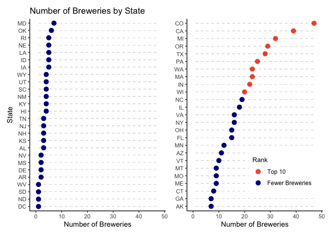

    #ggsave(overall_dtplt, filename = "plots/breweriesByState_dotPlt.png")

    #rename state abbreviation variable to merge with map data
    breweries_summary$state_abbv = breweries_summary$State
    breweries_summary$State = NULL
    breweries_summary$state_abbv = trimws(breweries_summary$state_abbv) #trim the whitespace

    #retrieve map data and join with brewery counts
    map_data = full_join(get_urbn_map(map = "states", sf = TRUE), breweries_summary, by = "state_abbv")

    #recreate CRS object (there was an error)
    map_data = st_as_sf(map_data)
    #check CRS
    st_crs(map_data)

    Coordinate Reference System:
      User input: EPSG:2163 
      wkt:
    PROJCRS["NAD27 / US National Atlas Equal Area",
        BASEGEOGCRS["NAD27",
            DATUM["North American Datum 1927",
                ELLIPSOID["Clarke 1866",6378206.4,294.978698213898,
                    LENGTHUNIT["metre",1]]],
            PRIMEM["Greenwich",0,
                ANGLEUNIT["degree",0.0174532925199433]],
            ID["EPSG",4267]],
        CONVERSION["US National Atlas Equal Area",
            METHOD["Lambert Azimuthal Equal Area (Spherical)",
                ID["EPSG",1027]],
            PARAMETER["Latitude of natural origin",45,
                ANGLEUNIT["degree",0.0174532925199433],
                ID["EPSG",8801]],
            PARAMETER["Longitude of natural origin",-100,
                ANGLEUNIT["degree",0.0174532925199433],
                ID["EPSG",8802]],
            PARAMETER["False easting",0,
                LENGTHUNIT["metre",1],
                ID["EPSG",8806]],
            PARAMETER["False northing",0,
                LENGTHUNIT["metre",1],
                ID["EPSG",8807]]],
        CS[Cartesian,2],
            AXIS["easting (X)",east,
                ORDER[1],
                LENGTHUNIT["metre",1]],
            AXIS["northing (Y)",north,
                ORDER[2],
                LENGTHUNIT["metre",1]],
        USAGE[
            SCOPE["Statistical analysis."],
            AREA["United States (USA) - onshore and offshore."],
            BBOX[15.56,167.65,74.71,-65.69]],
        ID["EPSG",9311]]

    #plot the number of breweries on a map
    map_plt = ggplot() +
      geom_sf(map_data, 
              mapping = aes(fill = Total_Breweries),
              size = 0.25, color = "black") +
      labs(fill = "Total Breweries") +
      geom_sf_text(data = map_data, 
                    aes(label = Total_Breweries), 
                size = 3, color = "black", fontface = "bold", fun.geometry = sf::st_centroid) +
      ggtitle("Total Breweries by State") +
      scale_fill_distiller(palette = "Spectral") +
      theme_bw() +
      theme(axis.title = element_blank(),
            axis.text = element_blank(), 
            axis.ticks = element_blank())
    map_plt

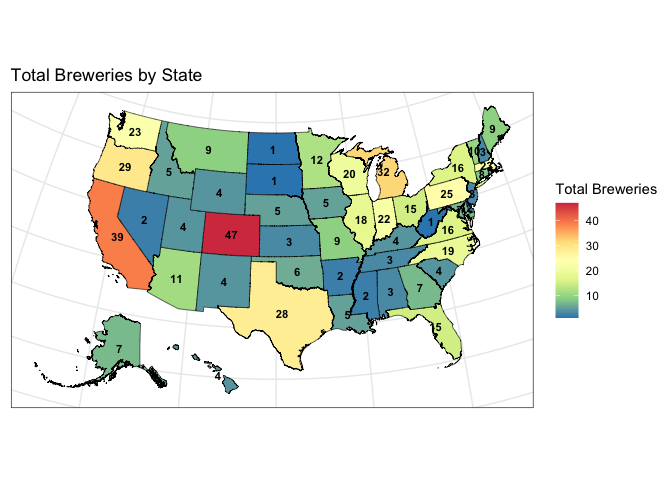

    #ggsave(map_plt, filename = "plots/map_plt.png")

-   Colorado has the most breweries with 47.
-   In addition to Colorado, the regions with a lot of breweries include
    Texas, the West Coast and the states around the Great Lakes.
-   Washington, DC, North and South Dakota, and West Virginia each have
    only one brewery.

**Question 2: Here we merge the two data sets, breweries and beers, by
the unique number associated with each brewery. The output of this
prints the first and last 6 observations in the merged data frame.**

    #2. Merge beer data with the breweries data. Print the first 6 observations and the last six observations to check the merged file.  (RMD only, this does not need to be included in the presentation or the deck.)

    bbDF = full_join(breweries, beers, by = join_by(Brew_ID == Brewery_id))

    bbDF = rename(bbDF, c("Brewery" = Name.x, "Beer" = Name.y))

    head(bbDF)

      Brew_ID            Brewery        City State count          Beer Beer_ID   ABV IBU
    1       1 NorthGate Brewing  Minneapolis    MN     1  Get Together    2692 0.045  50
    2       1 NorthGate Brewing  Minneapolis    MN     1 Maggie's Leap    2691 0.049  26
    3       1 NorthGate Brewing  Minneapolis    MN     1    Wall's End    2690 0.048  19
    4       1 NorthGate Brewing  Minneapolis    MN     1       Pumpion    2689 0.060  38
    5       1 NorthGate Brewing  Minneapolis    MN     1    Stronghold    2688 0.060  25
    6       1 NorthGate Brewing  Minneapolis    MN     1   Parapet ESB    2687 0.056  47
                                    Style Ounces
    1                        American IPA     16
    2                  Milk / Sweet Stout     16
    3                   English Brown Ale     16
    4                         Pumpkin Ale     16
    5                     American Porter     16
    6 Extra Special / Strong Bitter (ESB)     16

    tail(bbDF)

         Brew_ID                       Brewery          City State count                      Beer Beer_ID   ABV IBU
    2405     556         Ukiah Brewing Company         Ukiah    CA     1             Pilsner Ukiah      98 0.055  NA
    2406     557       Butternuts Beer and Ale Garrattsville    NY     1  Heinnieweisse Weissebier      52 0.049  NA
    2407     557       Butternuts Beer and Ale Garrattsville    NY     1           Snapperhead IPA      51 0.068  NA
    2408     557       Butternuts Beer and Ale Garrattsville    NY     1         Moo Thunder Stout      50 0.049  NA
    2409     557       Butternuts Beer and Ale Garrattsville    NY     1         Porkslap Pale Ale      49 0.043  NA
    2410     558 Sleeping Lady Brewing Company     Anchorage    AK     1 Urban Wilderness Pale Ale      30 0.049  NA
                           Style Ounces
    2405         German Pilsener     12
    2406              Hefeweizen     12
    2407            American IPA     12
    2408      Milk / Sweet Stout     12
    2409 American Pale Ale (APA)     12
    2410        English Pale Ale     12

**Question 3: Here we find the missing values in the dataset,
investigate the reason they may be missing, and categorize them into
missing completely at random, missing at random or not missing at
random.**

    #3. Address the missing values in each column.

    #what is missing?
    #what kind of missing are they: mcar, mar, nmar

    #some ideas for visualizing missing data from:
    #https://towardsdatascience.com/smart-handling-of-missing-data-in-r-6

    #convert empty strings (if any) to NA
    bbDF[bbDF == ""] = NA

    #this finds the number and percent of missing values in each variable
    miss_data = bbDF %>% 
      gather(key, value) %>%
      group_by(key) %>%
      count(na = is.na(value)) %>% 
      pivot_wider(names_from = na, values_from = n, values_fill = 0) %>%
      mutate(pct_missing = (`TRUE`/sum(`TRUE`, `FALSE`))*100) %>%
      ungroup()

    #this makes it into a table
    miss_data %>% gt()

<table class="gt_table" data-quarto-disable-processing="false" data-quarto-bootstrap="false">
  <thead>
    <tr class="gt_col_headings">
      <th class="gt_col_heading gt_columns_bottom_border gt_left" rowspan="1" colspan="1" scope="col" id="key">key</th>
      <th class="gt_col_heading gt_columns_bottom_border gt_right" rowspan="1" colspan="1" scope="col" id="FALSE">FALSE</th>
      <th class="gt_col_heading gt_columns_bottom_border gt_right" rowspan="1" colspan="1" scope="col" id="TRUE">TRUE</th>
      <th class="gt_col_heading gt_columns_bottom_border gt_right" rowspan="1" colspan="1" scope="col" id="pct_missing">pct_missing</th>
    </tr>
  </thead>
  <tbody class="gt_table_body">
    <tr><td headers="key" class="gt_row gt_left">ABV</td>
<td headers="FALSE" class="gt_row gt_right">2348</td>
<td headers="TRUE" class="gt_row gt_right">62</td>
<td headers="pct_missing" class="gt_row gt_right">2.5726141</td></tr>
    <tr><td headers="key" class="gt_row gt_left">Beer</td>
<td headers="FALSE" class="gt_row gt_right">2410</td>
<td headers="TRUE" class="gt_row gt_right">0</td>
<td headers="pct_missing" class="gt_row gt_right">0.0000000</td></tr>
    <tr><td headers="key" class="gt_row gt_left">Beer_ID</td>
<td headers="FALSE" class="gt_row gt_right">2410</td>
<td headers="TRUE" class="gt_row gt_right">0</td>
<td headers="pct_missing" class="gt_row gt_right">0.0000000</td></tr>
    <tr><td headers="key" class="gt_row gt_left">Brew_ID</td>
<td headers="FALSE" class="gt_row gt_right">2410</td>
<td headers="TRUE" class="gt_row gt_right">0</td>
<td headers="pct_missing" class="gt_row gt_right">0.0000000</td></tr>
    <tr><td headers="key" class="gt_row gt_left">Brewery</td>
<td headers="FALSE" class="gt_row gt_right">2410</td>
<td headers="TRUE" class="gt_row gt_right">0</td>
<td headers="pct_missing" class="gt_row gt_right">0.0000000</td></tr>
    <tr><td headers="key" class="gt_row gt_left">City</td>
<td headers="FALSE" class="gt_row gt_right">2410</td>
<td headers="TRUE" class="gt_row gt_right">0</td>
<td headers="pct_missing" class="gt_row gt_right">0.0000000</td></tr>
    <tr><td headers="key" class="gt_row gt_left">IBU</td>
<td headers="FALSE" class="gt_row gt_right">1405</td>
<td headers="TRUE" class="gt_row gt_right">1005</td>
<td headers="pct_missing" class="gt_row gt_right">41.7012448</td></tr>
    <tr><td headers="key" class="gt_row gt_left">Ounces</td>
<td headers="FALSE" class="gt_row gt_right">2410</td>
<td headers="TRUE" class="gt_row gt_right">0</td>
<td headers="pct_missing" class="gt_row gt_right">0.0000000</td></tr>
    <tr><td headers="key" class="gt_row gt_left">State</td>
<td headers="FALSE" class="gt_row gt_right">2410</td>
<td headers="TRUE" class="gt_row gt_right">0</td>
<td headers="pct_missing" class="gt_row gt_right">0.0000000</td></tr>
    <tr><td headers="key" class="gt_row gt_left">Style</td>
<td headers="FALSE" class="gt_row gt_right">2405</td>
<td headers="TRUE" class="gt_row gt_right">5</td>
<td headers="pct_missing" class="gt_row gt_right">0.2074689</td></tr>
    <tr><td headers="key" class="gt_row gt_left">count</td>
<td headers="FALSE" class="gt_row gt_right">2410</td>
<td headers="TRUE" class="gt_row gt_right">0</td>
<td headers="pct_missing" class="gt_row gt_right">0.0000000</td></tr>
  </tbody>
  
  
</table>

    #plot the percent missing for PPT
    miss_plot = plot_missing(bbDF)

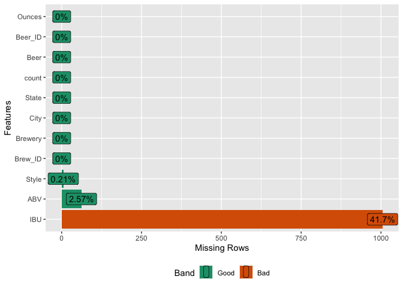

    #visualize what rows have missing values
    vis_miss(bbDF) + theme(axis.text.x = element_text(angle=80))

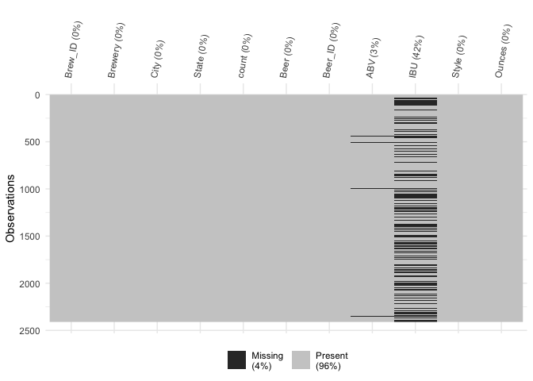

    #which combinations of variables occur to be missing together
    gg_miss_upset(bbDF)

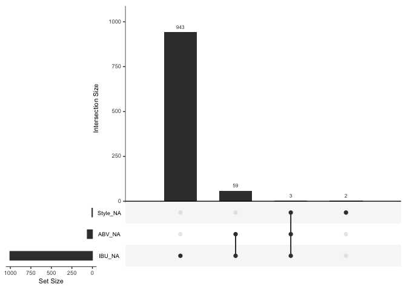

    #Little's MCAR test
    #statistical test that test the null hypothesis that missing are MCAR
    mcar_test(bbDF %>% select(!count))

    # A tibble: 1 × 4
      statistic    df       p.value missing.patterns
          <dbl> <dbl>         <dbl>            <int>
    1      105.    33 0.00000000171                5

    #what styles don't have any IBU values (all missing)
    prop_missing_style = bbDF %>%
      group_by(Style) %>%
      summarise(prop_missing = sum(is.na(IBU)) / n(), count = n())
    missing_styles = prop_missing_style %>% filter(prop_missing == 1)
    missing_styles %>% gt()

<table class="gt_table" data-quarto-disable-processing="false" data-quarto-bootstrap="false">
  <thead>
    <tr class="gt_col_headings">
      <th class="gt_col_heading gt_columns_bottom_border gt_center" rowspan="1" colspan="1" scope="col" id="Style">Style</th>
      <th class="gt_col_heading gt_columns_bottom_border gt_right" rowspan="1" colspan="1" scope="col" id="prop_missing">prop_missing</th>
      <th class="gt_col_heading gt_columns_bottom_border gt_right" rowspan="1" colspan="1" scope="col" id="count">count</th>
    </tr>
  </thead>
  <tbody class="gt_table_body">
    <tr><td headers="Style" class="gt_row gt_center">American Malt Liquor</td>
<td headers="prop_missing" class="gt_row gt_right">1</td>
<td headers="count" class="gt_row gt_right">1</td></tr>
    <tr><td headers="Style" class="gt_row gt_center">Braggot</td>
<td headers="prop_missing" class="gt_row gt_right">1</td>
<td headers="count" class="gt_row gt_right">1</td></tr>
    <tr><td headers="Style" class="gt_row gt_center">Cider</td>
<td headers="prop_missing" class="gt_row gt_right">1</td>
<td headers="count" class="gt_row gt_right">37</td></tr>
    <tr><td headers="Style" class="gt_row gt_center">Flanders Red Ale</td>
<td headers="prop_missing" class="gt_row gt_right">1</td>
<td headers="count" class="gt_row gt_right">1</td></tr>
    <tr><td headers="Style" class="gt_row gt_center">Kristalweizen</td>
<td headers="prop_missing" class="gt_row gt_right">1</td>
<td headers="count" class="gt_row gt_right">1</td></tr>
    <tr><td headers="Style" class="gt_row gt_center">Low Alcohol Beer</td>
<td headers="prop_missing" class="gt_row gt_right">1</td>
<td headers="count" class="gt_row gt_right">1</td></tr>
    <tr><td headers="Style" class="gt_row gt_center">Mead</td>
<td headers="prop_missing" class="gt_row gt_right">1</td>
<td headers="count" class="gt_row gt_right">5</td></tr>
    <tr><td headers="Style" class="gt_row gt_center">Rauchbier</td>
<td headers="prop_missing" class="gt_row gt_right">1</td>
<td headers="count" class="gt_row gt_right">2</td></tr>
    <tr><td headers="Style" class="gt_row gt_center">Shandy</td>
<td headers="prop_missing" class="gt_row gt_right">1</td>
<td headers="count" class="gt_row gt_right">3</td></tr>
  </tbody>
  
  
</table>

    sum(missing_styles$count) #number of observations from styles with no IBU data

    [1] 52

    #filter rows from bbDF where Style does not have IBU value
    filtered_bbDF = bbDF %>% 
      filter(!Style %in% missing_styles$Style)

    #are the IPAs more likely to report IBU?
    #find indexes for different styles with different IBU profiles (lagers - low, ipas - high)
    #initialize a new column to hold the values
    filtered_bbDF$IBU_Profile = NA

    #assign values based on conditions
    filtered_bbDF$IBU_Profile[grepl("\\bAle\\b", filtered_bbDF$Style, ignore.case = TRUE)] = "Ale"
    filtered_bbDF$IBU_Profile[grepl("\\bLager\\b", filtered_bbDF$Style, ignore.case = TRUE)] = "Lager"
    filtered_bbDF$IBU_Profile[grepl("IPA", filtered_bbDF$Style, ignore.case = TRUE)] = "IPA"
    filtered_bbDF$IBU_Profile[!grepl("IPA|\\bAle\\b|\\bLager\\b", filtered_bbDF$Style, ignore.case = TRUE)] = "Other"

    #calculate the proportion of missing values in the IBU column for each factor level in IBU_Profile
    prop_missing = filtered_bbDF %>%
      group_by(IBU_Profile) %>%
      summarise(prop_missing = sum(is.na(IBU)) / n())

    prop_missing$IBU_Profile = factor(prop_missing$IBU_Profile, levels = c("IPA", "Ale", "Lager", "Other"))

    #plot the proportions
    prop_missing_4groups = ggplot(prop_missing,
                                  aes(x = IBU_Profile, y = prop_missing)) +
      geom_col(fill = "gray") +
      labs(x = "IBU Profile", y = "Proportion of Missing Values", title = "Proportion of Missing Values by Style / IBU Profile") +
      scale_y_continuous(labels = scales::percent) +  # Convert y-axis labels to percentage
      theme(axis.text.x = element_text(angle = 45, hjust = 1)) +
      theme_bw()
    prop_missing_4groups

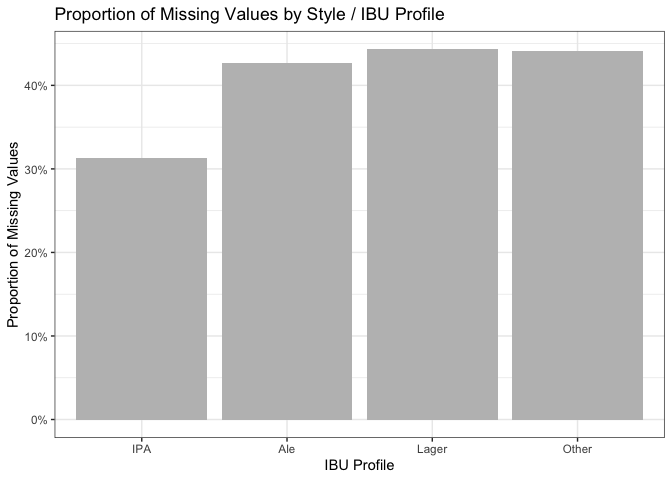

    #ggsave(prop_missing_4groups, filename = "plots/prop_missing_4groups.png")

    #group Ale, Lager, and Other into "Other" category
    filtered_bbDF$IBU_Profile2 = ifelse(filtered_bbDF$IBU_Profile == "IPA", "IPA", "Not_IPA")

    #calculate the proportion of missing values for IPA and Other
    prop_missing = filtered_bbDF %>%
      group_by(IBU_Profile2) %>%
      summarize(prop_missing = sum(is.na(IBU)) / n())

    #plot the missing proportions of IPA and other
    prop_missing_2groups = ggplot(prop_missing,
                                  aes(x = IBU_Profile2, y = prop_missing)) +
      geom_col(fill = "gray") +
      labs(x = "IBU Profile", y = "Proportion of Missing Values", title = "Proportion of Missing Values by Style / IBU Profile") +
      scale_y_continuous(labels = scales::percent) +  # Convert y-axis labels to percentage
      theme(axis.text.x = element_text(angle = 45, hjust = 1)) +
      theme_bw()
    prop_missing_2groups

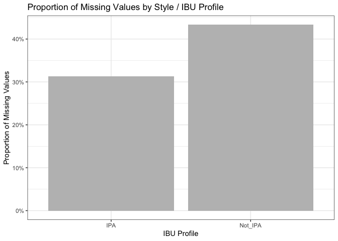

    #ggsave(prop_missing_2groups, filename = "plots/prop_missing_2groups.png")

Out of the 10 columns in our dataset, three contain missing data.
Specifically, IBU is missing in 41.7% of cases (1005 out of 2410
observations), while ABV and Style have much lower rates of missing
values: 2.6% and 0.2% respectively.

Certain beer styles, such as Cider, American Malt Liquor, Mead, and
Shandy, lack IBU values entirely, totaling 52 observations. Given that
these styles might not be associated with bitterness, it’s reasonable to
assume that IBU values are not reported for them. This suggests that the
data are not missing completely at random (MCAR). A statistical test,
Little’s MCAR test, confirms this with a p-value of 3.8e-10, indicating
statistically significant evidence against MCAR.

Additionally, a report in the Journal of Food Engineering
(<https://doi.org/10.1016/j.jfoodeng.2019.05.015>), highlights the high
cost of measuring IBU, possibly contributing to its absence in many
cases. This suggests that the data might be missing at random (MAR)
rather than not missing at random (NMAR). Even when grouping styles into
IPA and others, the differences in missing IBU percentages (31.3% and
43.3% respectively) weren’t substantial. Examining covariates didn’t
reveal a single factor responsible for missing IBU scores. For these
reasons, we decided to the best way to deal with the missing IBU and ABV
values would be imputing them with the median value of the categorical
predictor Style.

**Question 3b: Given our determination that IBU values are missing at
random (MAR), here we impute missing IBU values with the median IBU for
each beer style, resulting in 953 imputed values. There were nine beer
styles with all IBUs missing, representing 52 instances of mostly ciders
or &lt; 2.2% of the data. We chose not to impute values to avoid
introducing bias, restricting our findings instead to the 91 remaining
styles with available data. Regarding missing ABV values, all 62
instances coincided with missing IBU values. Since this represented &lt;
2.6% of the dataset, we opted to delete these entries rather than impute
values, leaving us with 2296 beers for analysis, retaining over 95% of
the original dataset.**

    #deal with the missing values by imputation of the median by style 
    #IBU is right skewed so median maybe better than mean
    #decided not to impute ABV to because < 3% of data is missing
    #and to avoid observations with imputed ABV and IBU

    #how many are missing IBU in each style
    missingIBU = bbDF %>% 
      filter(is.na(IBU)) %>% group_by(Style) %>% 
      summarize(missingCount = n())
    #find the median IBU for each style
    totalIBU = bbDF %>% 
      group_by(Style) %>% 
      summarize(medianIBU = median(IBU, na.rm = TRUE), totalCount = n())
    #merge these
    missIBU_summary = full_join(totalIBU, missingIBU, by = join_by(Style))
    #quantify the proportion IBU missing in each style
    missIBU_summary = missIBU_summary %>% 
      mutate(propMissingStyle = missingCount/totalCount)

    #impute median for IBU
    imputedDF = merge(bbDF, totalIBU[,1:2], by="Style")
    na_idx = which(is.na(imputedDF$IBU))
    length(na_idx) #num missing before imputation

    [1] 1005

    imputedDF[na_idx,"IBU"] = imputedDF[na_idx,"medianIBU"]
    na_idx = which(is.na(imputedDF$IBU))
    length(na_idx) #num 100% IBU missing - for deletion

    [1] 52

    #replot the percent missing for PPT
    imputedDF_rmMedianIBU = subset(imputedDF, select = -medianIBU)
    miss_plot2 = plot_missing(imputedDF_rmMedianIBU)

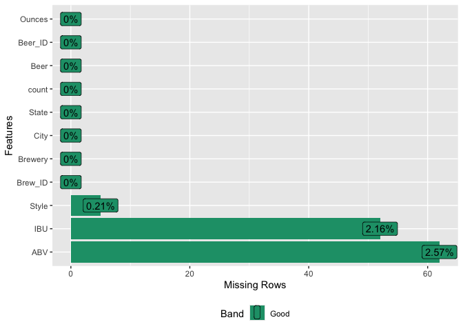

    #delete obs for styles with no IBU data, and missing ABV, leave style for scatterplot
    cleanDF = imputedDF[!is.na(imputedDF$IBU), ]

    length(which(is.na(imputedDF$ABV)))

    [1] 62

    length(which(is.na(imputedDF$ABV) & is.na(imputedDF$IBU)))

    [1] 0

    #this above confirms that if we impute ABV, it will be on 62 obs with imputed IBU

    cleanDF = cleanDF[!is.na(cleanDF$ABV), ]

**Question 4: This computes the median alcohol by volume (ABV) and
international bitterness unit (IBU) for each state. We output the sorted
state medians to view the numbers. Then we generated a bar chart with
IBU on the left Y axis in blue and ABV on the right Y axis in red. Each
state has the bars overlaid for each metric.**

    #4. Compute the median alcohol content and international bitterness unit for each state. Plot a bar chart to compare.

    #first do it removing the NAs (bbDF)
    medians = bbDF %>% group_by(State) %>%
      summarize(medianABV = median(ABV, na.rm = TRUE), medianIBU = median(IBU, na.rm = TRUE))

    head(medians %>% arrange(desc(medianABV)))

    # A tibble: 6 × 3
      State medianABV medianIBU
      <fct>     <dbl>     <dbl>
    1 " DC"    0.0625      47.5
    2 " KY"    0.0625      31.5
    3 " MI"    0.062       35  
    4 " NM"    0.062       51  
    5 " WV"    0.062       57.5
    6 " CO"    0.0605      40  

    head(medians %>% arrange(medianABV))

    # A tibble: 6 × 3
      State medianABV medianIBU
      <fct>     <dbl>     <dbl>
    1 " UT"     0.04       34  
    2 " NJ"     0.046      34.5
    3 " KS"     0.05       20  
    4 " ND"     0.05       32  
    5 " WY"     0.05       21  
    6 " ME"     0.051      61  

    head(medians %>% arrange(desc(medianIBU)))

    # A tibble: 6 × 3
      State medianABV medianIBU
      <fct>     <dbl>     <dbl>
    1 " ME"     0.051      61  
    2 " WV"     0.062      57.5
    3 " FL"     0.057      55  
    4 " GA"     0.055      55  
    5 " DE"     0.055      52  
    6 " NM"     0.062      51  

    head(medians %>% arrange(medianIBU))

    # A tibble: 6 × 3
      State medianABV medianIBU
      <fct>     <dbl>     <dbl>
    1 " WI"     0.052      19  
    2 " KS"     0.05       20  
    3 " AZ"     0.055      20.5
    4 " WY"     0.05       21  
    5 " HI"     0.054      22.5
    6 " MO"     0.052      24  

    #plot a bar chart with 2 y-axes
    # Value used to transform the data (ABV*10 = IBU)
    coeff = .1

    # A few constants
    ABVColor = "red3"
    ABVFill = "tomato2"
    ABVAlpha = .2
    IBUColor = "royalblue3"
    IBUFill = "skyblue2"
    IBUAlpha = .9

    overlaidMediansOrig_plt = medians %>% 
      ggplot(aes(x = State)) +
      geom_bar(aes(y = medianIBU), stat="identity",
               fill=IBUFill, color=IBUColor, alpha=IBUAlpha) +
      geom_bar(aes(y = medianABV*1000), stat="identity",
               fill=ABVFill, color=ABVColor, alpha=ABVAlpha) + 
      #multiply by 100 to make a percentage and then by 10 to scale for the axis
      scale_y_continuous(
        # Features of the first axis
        name = "International Bitterness Unit (IBU)",
        # Add a second axis and specify its features
        sec.axis = sec_axis(~.*coeff, name = "Percent Alcohol by Volume (ABV)"
      )) + 
      theme_bw() +
      theme(
        axis.title.y.right = element_text(color = ABVColor, size=11),
        axis.title.y = element_text(color = IBUColor, size=11),
        axis.text.x = element_text(angle = 90)
      ) +
      ggtitle("Beer Statistics: Median by State") +
      xlab("State") +
      labs(caption = "with missing values removed")
    overlaidMediansOrig_plt

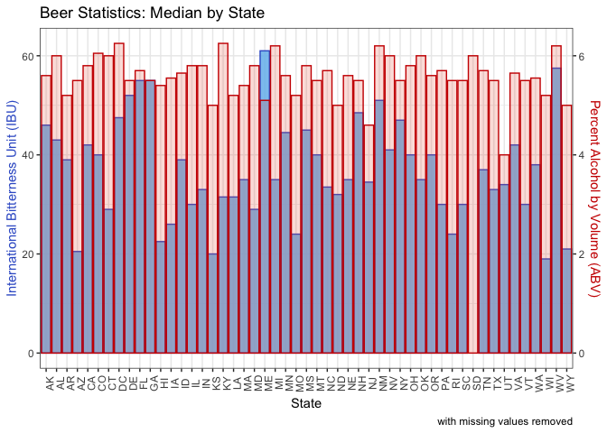

    #ggsave(overlaidMediansOrig_plt, filename = "plots/overlaidMediansOrig_plt.png")

    #then do it with the imputed values (cleanDF)
    medians = cleanDF %>% group_by(State) %>%
      summarize(medianABV = median(ABV, na.rm = TRUE), medianIBU = median(IBU, na.rm = TRUE))

    head(medians %>% arrange(desc(medianABV)))

    # A tibble: 6 × 3
      State medianABV medianIBU
      <fct>     <dbl>     <dbl>
    1 " DC"    0.0625      27  
    2 " KY"    0.0625      29  
    3 " NM"    0.062       35  
    4 " WV"    0.062       57.5
    5 " AL"    0.06        39.5
    6 " CO"    0.06        35  

    head(medians %>% arrange(medianABV))

    # A tibble: 6 × 3
      State medianABV medianIBU
      <fct>     <dbl>     <dbl>
    1 " UT"     0.04       33.5
    2 " NJ"     0.046      34.5
    3 " KS"     0.05       22  
    4 " ND"     0.05       32  
    5 " WY"     0.05       21.5
    6 " ME"     0.051      36  

    head(medians %>% arrange(desc(medianIBU)))

    # A tibble: 6 × 3
      State medianABV medianIBU
      <fct>     <dbl>     <dbl>
    1 " WV"     0.062      57.5
    2 " DE"     0.055      52  
    3 " MS"     0.058      45  
    4 " VT"     0.055      45  
    5 " MN"     0.056      44.5
    6 " NV"     0.06       41  

    head(medians %>% arrange(medianIBU))

    # A tibble: 6 × 3
      State medianABV medianIBU
      <fct>     <dbl>     <dbl>
    1 " NH"     0.055      17.8
    2 " WI"     0.052      20  
    3 " AZ"     0.055      21  
    4 " WY"     0.05       21.5
    5 " KS"     0.05       22  
    6 " RI"     0.055      24  

    #plot a bar chart with 2 y-axes
    # Value used to transform the data (ABV*10 = IBU)
    coeff = .1

    # A few constants
    ABVColor = "red3"
    ABVFill = "tomato2"
    ABVAlpha = .2
    IBUColor = "royalblue3"
    IBUFill = "skyblue2"
    IBUAlpha = .9

    overlaidMediansImp_plt = medians %>% 
      ggplot(aes(x = State)) +
      geom_bar(aes(y = medianIBU), stat="identity",
               fill=IBUFill, color=IBUColor, alpha=IBUAlpha) +
      geom_bar(aes(y = medianABV*1000), stat="identity",
               fill=ABVFill, color=ABVColor, alpha=ABVAlpha) + 
      #multiply by 100 to make a percentage and then by 10 to scale for the axis
      scale_y_continuous(
        # Features of the first axis
        name = "International Bitterness Unit (IBU)",
        # Add a second axis and specify its features
        sec.axis = sec_axis(~.*coeff, name = "Percent Alcohol by Volume (ABV)"
      )) + 
      theme_bw() +
      theme(
        axis.title.y.right = element_text(color = ABVColor, size=11),
        axis.title.y = element_text(color = IBUColor, size=11),
        axis.text.x = element_text(angle = 90)
      ) +
      ggtitle("Beer Statistics: Median by State") +
      xlab("State") +
      labs(caption = "for 2296 beers (after data imputation)")
    overlaidMediansImp_plt

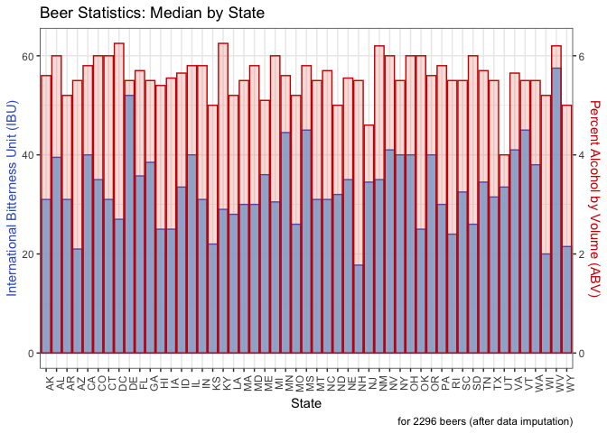

    #ggsave(overlaidMediansImp_plt, filename = "plots/overlaidMediansImp_plt.png")

-   Washington,DC and Kentucky have the highest median ABV, each at
    6.25%. Utah has the lowest, under 5%.
-   WV and DE have the highest IBU. NH and WI have the lowest. (The
    results are different when removing rather than imputing data. If we
    were to remove data, ME and WV would have the highest IBU and WI and
    KS the lowest.)
-   WV is high in both categories.

**Question 5: This finds the beer with the highest ABV and the beer with
the highest IBU.**

    #5. Which state has the maximum alcoholic (ABV) beer? Which state has the most bitter (IBU) beer?

    #finding the overall most ABV and IBU and find the state it is in
    head(bbDF %>% arrange(desc(ABV), State, Brew_ID))

      Brew_ID                    Brewery       City State count                                                 Beer
    1      52    Upslope Brewing Company    Boulder    CO     1 Lee Hill Series Vol. 5 - Belgian Style Quadrupel Ale
    2       2  Against the Grain Brewery Louisville    KY     1                                       London Balling
    3      18    Tin Man Brewing Company Evansville    IN     1                                                 Csar
    4      52    Upslope Brewing Company    Boulder    CO     1     Lee Hill Series Vol. 4 - Manhattan Style Rye Ale
    5      47        Sixpoint Craft Ales   Brooklyn    NY     1                                               4Beans
    6      34 The Dudes' Brewing Company   Torrance    CA     1                                         Double Trunk
      Beer_ID   ABV IBU                          Style Ounces
    1    2565 0.128  NA               Quadrupel (Quad)   19.2
    2    2685 0.125  80             English Barleywine   16.0
    3    2621 0.120  90         Russian Imperial Stout   16.0
    4    2564 0.104  NA                       Rye Beer   19.2
    5    2574 0.100  52                  Baltic Porter   12.0
    6    1561 0.099 101 American Double / Imperial IPA   16.0

    head(bbDF %>% arrange(desc(IBU), State, Brew_ID))

      Brew_ID                            Brewery            City State count                            Beer Beer_ID
    1     375            Astoria Brewing Company         Astoria    OR     1       Bitter Bitch Imperial IPA     980
    2     345         Wolf Hills Brewing Company        Abingdon    VA     1              Troopers Alley IPA    1676
    3     231           Cape Ann Brewing Company      Gloucester    MA     1                   Dead-Eye DIPA    2067
    4     100 Christian Moerlein Brewing Company      Cincinnati    OH     1 Bay of Bengal Double IPA (2014)    2440
    5      62              Surly Brewing Company Brooklyn Center    MN     1                    Abrasive Ale      15
    6     273                      The Alchemist       Waterbury    VT     1                    Heady Topper    1111
        ABV IBU                          Style Ounces
    1 0.082 138 American Double / Imperial IPA     12
    2 0.059 135                   American IPA     12
    3 0.090 130 American Double / Imperial IPA     16
    4 0.089 126 American Double / Imperial IPA     12
    5 0.097 120 American Double / Imperial IPA     16
    6 0.080 120 American Double / Imperial IPA     16

-   The highest percent alcohol beer overall is in Colorado. It is
    Upslope Brewing Company’s Lee Hill Series Vol. 5 - Belgian Style
    Quadrupel Ale with an ABV of 12.8%.
-   The most bitter beer overall is in Oregon. It is Astoria Brewing
    Company’s Bitter Bitch Imperial IPA with a IBU of 138.

**Question 6: This finds summary statistics (values of the minimum, 25th
percentile, median, 75th percentile, the maximum, plus the mean) for
ABV. We also plot a histogram and boxplot to visualize the
distribution.**

    #6. Comment on the summary statistics and distribution of the ABV variable.

    summaryStats = cleanDF %>% select(ABV, IBU, Ounces) %>%
      summarize(across(where(is.numeric),
                       .fns = list(min = ~min(., na.rm = TRUE),
                                  median = ~median(., na.rm = TRUE),
                                  mean = ~mean(., na.rm = TRUE),
                                  stdev = ~sd(., na.rm = TRUE),
                                  q25 = ~quantile(., 0.25, na.rm = TRUE),
                                  q75 = ~quantile(., 0.75, na.rm = TRUE),
                                  max = ~max(., na.rm = TRUE)),
                       .names = "{.col}_{.fn}")) %>%
      pivot_longer(cols = everything(), names_sep='_', names_to=c('variable', '.value'))
    summary_IBUnaRM = bbDF %>% select(IBU) %>%
      summarize(across(where(is.numeric),
                       .fns = list(min = ~min(., na.rm = TRUE),
                                  median = ~median(., na.rm = TRUE),
                                  mean = ~mean(., na.rm = TRUE),
                                  stdev = ~sd(., na.rm = TRUE),
                                  q25 = ~quantile(., 0.25, na.rm = TRUE),
                                  q75 = ~quantile(., 0.75, na.rm = TRUE),
                                  max = ~max(., na.rm = TRUE)),
                       .names = "{.col}_{.fn}")) %>%
      pivot_longer(cols = everything(), names_sep='_', names_to=c('variable', '.value'))
    summaryStats = rbind(summaryStats, summary_IBUnaRM)
    summaryStats[2,1] = "IBU_withImputing"
    summaryStats[4,1] = "IBU_NArm"
    summaryStats %>% gt()

<table class="gt_table" data-quarto-disable-processing="false" data-quarto-bootstrap="false">
  <thead>
    <tr class="gt_col_headings">
      <th class="gt_col_heading gt_columns_bottom_border gt_left" rowspan="1" colspan="1" scope="col" id="variable">variable</th>
      <th class="gt_col_heading gt_columns_bottom_border gt_right" rowspan="1" colspan="1" scope="col" id="min">min</th>
      <th class="gt_col_heading gt_columns_bottom_border gt_right" rowspan="1" colspan="1" scope="col" id="median">median</th>
      <th class="gt_col_heading gt_columns_bottom_border gt_right" rowspan="1" colspan="1" scope="col" id="mean">mean</th>
      <th class="gt_col_heading gt_columns_bottom_border gt_right" rowspan="1" colspan="1" scope="col" id="stdev">stdev</th>
      <th class="gt_col_heading gt_columns_bottom_border gt_right" rowspan="1" colspan="1" scope="col" id="q25">q25</th>
      <th class="gt_col_heading gt_columns_bottom_border gt_right" rowspan="1" colspan="1" scope="col" id="q75">q75</th>
      <th class="gt_col_heading gt_columns_bottom_border gt_right" rowspan="1" colspan="1" scope="col" id="max">max</th>
    </tr>
  </thead>
  <tbody class="gt_table_body">
    <tr><td headers="variable" class="gt_row gt_left">ABV</td>
<td headers="min" class="gt_row gt_right">0.027</td>
<td headers="median" class="gt_row gt_right">0.056</td>
<td headers="mean" class="gt_row gt_right">0.05975218</td>
<td headers="stdev" class="gt_row gt_right">0.01352834</td>
<td headers="q25" class="gt_row gt_right">0.05</td>
<td headers="q75" class="gt_row gt_right">0.067</td>
<td headers="max" class="gt_row gt_right">0.128</td></tr>
    <tr><td headers="variable" class="gt_row gt_left">IBU_withImputing</td>
<td headers="min" class="gt_row gt_right">4.000</td>
<td headers="median" class="gt_row gt_right">32.000</td>
<td headers="mean" class="gt_row gt_right">40.57491289</td>
<td headers="stdev" class="gt_row gt_right">24.24038219</td>
<td headers="q25" class="gt_row gt_right">21.00</td>
<td headers="q75" class="gt_row gt_right">60.000</td>
<td headers="max" class="gt_row gt_right">138.000</td></tr>
    <tr><td headers="variable" class="gt_row gt_left">Ounces</td>
<td headers="min" class="gt_row gt_right">8.400</td>
<td headers="median" class="gt_row gt_right">12.000</td>
<td headers="mean" class="gt_row gt_right">13.57060105</td>
<td headers="stdev" class="gt_row gt_right">2.32547562</td>
<td headers="q25" class="gt_row gt_right">12.00</td>
<td headers="q75" class="gt_row gt_right">16.000</td>
<td headers="max" class="gt_row gt_right">32.000</td></tr>
    <tr><td headers="variable" class="gt_row gt_left">IBU_NArm</td>
<td headers="min" class="gt_row gt_right">4.000</td>
<td headers="median" class="gt_row gt_right">35.000</td>
<td headers="mean" class="gt_row gt_right">42.71316726</td>
<td headers="stdev" class="gt_row gt_right">25.95406591</td>
<td headers="q25" class="gt_row gt_right">21.00</td>
<td headers="q75" class="gt_row gt_right">64.000</td>
<td headers="max" class="gt_row gt_right">138.000</td></tr>
  </tbody>
  
  
</table>

    ABV_bxplt = summaryStats %>% filter(variable == "ABV") %>% 
      mutate(across(where(is.numeric), ~ .x * 100)) %>% 
      ggplot(aes(x = variable)) +
      geom_boxplot(
       aes(ymin = min, lower = q25, middle = median, upper = q75, ymax = max),
       stat = "identity", fill = "royalblue3", alpha = 0.9) +
      geom_point(aes(y = mean), color = "red4") +
      ylab("Percent ABV") + 
      coord_flip() +
      theme_bw() +
      theme(legend.position = "none",
            axis.text.y = element_blank(),
            axis.title.y = element_blank(),
            axis.title.x = element_text(size = 11))
    missing_hist = bbDF %>% 
      ggplot() +
      geom_histogram(aes(x = ABV*100), fill = "royalblue3", binwidth = 0.5) +
      geom_vline(xintercept = summaryStats$mean[1]*100, color = "red4") +
      geom_vline(xintercept = summaryStats$median[1]*100, color = "black", linewidth = 1) +
      ggtitle("Distribution of Alcohol By Volume (ABV)") +
      ylab("Number of Beers") +
      ylim(0, 530) +
      xlim(0, 13) +
      theme_bw() +
      theme(axis.title.x = element_blank(),
            axis.title.y = element_text(size = 10))
    ABV_dist = missing_hist / ABV_bxplt
    ABV_dist

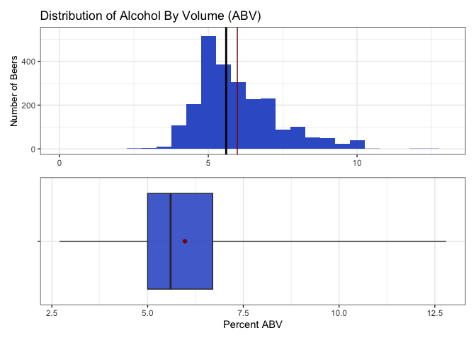

    #ggsave(ABV_dist, filename = "plots/ABV_distCombo.png")

-   The distribution of ABV is a bit skewed to the higher percents.
-   The lowest percent alcohol beers have almost no alcohol, while the
    most are nearly 13% alcohol.
-   The median is 5.6%. Because the mean is more sensitive to extreme
    values, it is slightly more right shifted at 6.0%.
-   Half of the beers fall in the 5.0 - 6.7 percent alcohol range.

**Question 7: Here we generate a scatterplot of ABV and IBU with a
linear regression line. Because we do not know which metric might be the
independent versus the dependent variable, we chose to find the
Pearson’s correlation coefficient instead of running a linear
regression.**

    #7. Is there an apparent relationship between the bitterness of the beer and its alcoholic content? Draw a scatter plot. Make your best judgment of a relationship and EXPLAIN your answer.

    #first do it removing the NAs (bbDF) for comparison
    #create a scatterplot with a linear line and the correlation coefficent embedded
    regres_NArm_plt = bbDF %>% 
      ggplot(aes(x = IBU, y = ABV*100)) +
      geom_point(alpha = 0.4) +
      geom_smooth(method = "lm", color = "blue") +
      ggtitle("Alcohol Content and Bitterness of Beers Produced in the US") +
      xlab("International Bitterness Unit (IBU)") +
      ylab("Percent Alcohol by Volume (ABV)") +
      labs(caption = "with missing values removed") +
      theme_bw()
    regres_NArm_plt

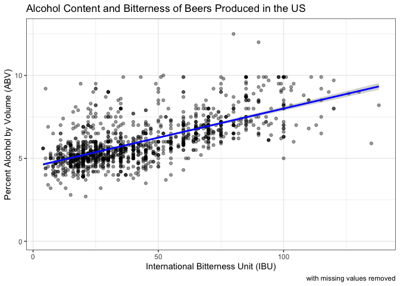

    #ggsave(regres_NArm_plt, filename = "plots/IBU_ABV_NArmScatterPlt.png")

    #statistically evaluate if there is a positive relationship between alcohol and bitterness
    correlation_coefficient_NArm = cor(bbDF$ABV, bbDF$IBU, use = "complete.obs")

    #perform correlation test ignoring missing values
    cor_test_result_NArm =  cor.test(bbDF$ABV, bbDF$IBU,  method = "pearson", use = "complete.obs")

    #extract correlation coefficient and confidence intervals
    correlation_coefficient_NArm = cor_test_result_NArm$estimate
    conf_interval_NArm = cor_test_result_NArm$conf.int

    #output
    cat("Correlation Coefficient with missing values removed:", correlation_coefficient_NArm, "\n")

    Correlation Coefficient with missing values removed: 0.6706215 

    cat("Confidence Interval", conf_interval_NArm, "\n")

    Confidence Interval 0.6407982 0.6984238 

    cat("Number of Complete Cases:", sum(complete.cases(bbDF)), "\n")

    Number of Complete Cases: 1403 

    #then do it with the imputed values (cleanDF)
    #create a scatterplot with a linear line and the correlation coefficent embedded
    regres_imputed_plt = cleanDF %>% 
      ggplot(aes(x = IBU, y = ABV*100)) +
      geom_point(alpha = 0.4) +
      geom_smooth(method = "lm", color = "blue") +
      ggtitle("Alcohol Content and Bitterness of Beers Produced in the US") +
      xlab("International Bitterness Unit (IBU)") +
      ylab("Percent Alcohol by Volume (ABV)") +
      labs(caption = "for 2296 beers (after data imputation)") +
      theme_bw()
    regres_imputed_plt

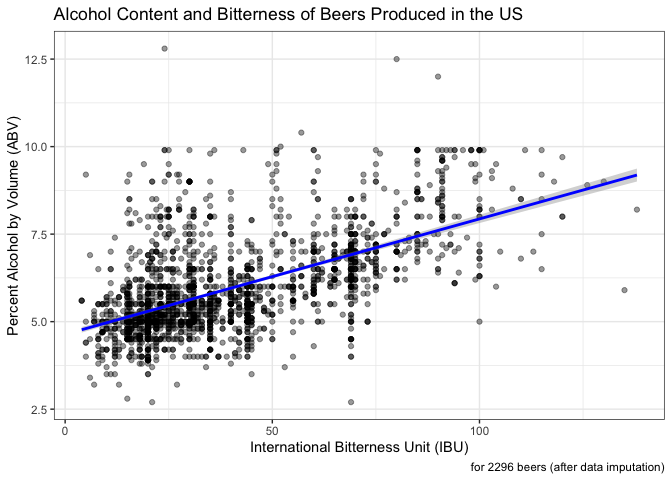

    #ggsave(regres_imputed_plt, filename = "plots/IBU_ABV_imputedScatterPlt.png")

    #statistically evaluate if there is a positive relationship between alcohol and bitterness
    correlation_coefficient = cor(cleanDF$ABV, cleanDF$IBU, use = "complete.obs")

    #perform correlation test ignoring missing values
    cor_test_result =  cor.test(cleanDF$ABV, cleanDF$IBU,  method = "pearson", use = "complete.obs")

    #extract correlation coefficient and confidence intervals
    correlation_coefficient = cor_test_result$estimate
    conf_interval = cor_test_result$conf.int

    #output for PPT
    cat("Correlation Coefficient (with imputed values):", correlation_coefficient, "\n")

    Correlation Coefficient (with imputed values): 0.5908138 

    cat("Confidence Interval:", conf_interval, "\n")

    Confidence Interval: 0.5635259 0.6168137 

    cat("Number of Complete Cases:", sum(complete.cases(cleanDF)), "\n") #two are complete for ABV/IBU but missing style

    Number of Complete Cases: 2294 

After imputation of IBU by style, of the 2410 beers, 2296 had ABV and
IBU data. In these complete cases, there is evidence of a positive
relationship between ABV and IBU. The correlation coefficient is 0.59
with a 95% confidence interval (0.56, 0.62). If we were to remove rather
than impute missing IBU values, the correlation coefficient is a little
higher, 0.67. However, we feel the imputed data is likely a more
accurate reflection of the data and still shows evidence of a positive
relationship between ABV and IBU values.

**Question 8: Here we filter the dataset to examine only IPAs and Ales.
Then, we use KNN classification to provide statistical evidence
assessing if beers can be classified into Style, IPA or Ale, based on
their ABV and IBU values.**

    #8 (part 1).    Budweiser would also like to investigate the difference with respect to IBU and ABV between IPAs (India Pale Ales) and other types of Ale (any beer with “Ale” in its name other than IPA).

    #We wrote/ran this code on the filtered_bbDF in the missing value chunk
    #filtered_bbDF had styles with no IBU scores removed
    cleanDF$IBU_Profile = NA

    #assign values based on conditions
    cleanDF$IBU_Profile[grepl("\\bAle\\b|\\bAle", cleanDF$Style, ignore.case = TRUE)] = "Ale"
    cleanDF$IBU_Profile[grepl("IPA", cleanDF$Style, ignore.case = TRUE)] = "IPA"
    cleanDF$IBU_Profile[!grepl("IPA|\\bAle\\b|\\bAle", cleanDF$Style, ignore.case = TRUE)] = "Other"

    #filtered for the IPAs and Ales
    IPAvAle_clean = cleanDF %>% filter(IBU_Profile == "IPA" | IBU_Profile == "Ale")

    #scale ABV & IBU
    IPAvAle_clean$Z_ABV = scale(IPAvAle_clean$ABV)
    IPAvAle_clean$Z_IBU = scale(IPAvAle_clean$IBU)

    #do a 70-30 train/test cross validation with k = 1-50
    splitPerc = 0.70

    #loop for many k and the average of many training / test partition
    iterations = 100   #different training and test sets
    numks = 50         #tuning the hyper-parameter k = 1-50
    masterAcc = matrix(nrow = iterations, ncol = numks)
    for(j in 1:iterations)
    {
      accs = data.frame(accuracy = numeric(50), k = numeric(50))
      #randomly sample the indexes, pull ~2000*.75 times
      trainInd = sample(1:dim(IPAvAle_clean)[1], round(splitPerc * dim(IPAvAle_clean)[1]))
      train = IPAvAle_clean[trainInd,]
      test = IPAvAle_clean[-trainInd,]
      for(i in 1:numks)
      {
        #use ABV and IBU as predictors of IPA or Ale
        classifications = knn(train[,c("Z_ABV", "Z_IBU")],test[,c("Z_ABV", "Z_IBU")],train$IBU_Profile, prob = T, k = i)
        table(classifications,test$IBU_Profile)
        CM = confusionMatrix(table(classifications,test$IBU_Profile))
        masterAcc[j,i] = CM$overall[1]
      }
    }
    MeanAcc = colMeans(masterAcc)
    #png(file = "plots/tuneK_plt.png")
    plot(seq(1,numks,1), MeanAcc, type = "l",
         panel.first = grid(5,),
         xaxs = "i",
         xaxp = c(0, 50, 5),
         main = paste("Mean accuracy for values of k", "\nfrom 100 iterations"),
         xlab = "k parameter", ylab = "Mean accuracy")

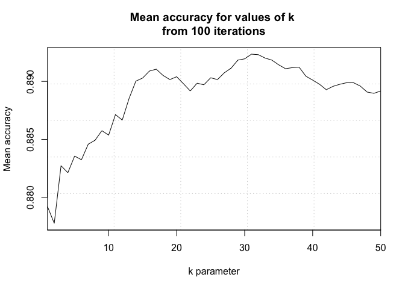

    #dev.off()
    #optimal k = ~16

    set.seed(42)
    opt_k = 16

    #create training and test sets
    trainInd = sample(1:dim(IPAvAle_clean)[1], round(splitPerc * dim(IPAvAle_clean)[1]))
    train = IPAvAle_clean[trainInd,]
    test = IPAvAle_clean[-trainInd,]

    #Standardized External CV
    classifications = knn(train[,c("Z_ABV", "Z_IBU")], test[,c("Z_ABV", "Z_IBU")], train$IBU_Profile,
                          prob = TRUE, k = opt_k)
    cmE_std = confusionMatrix(table(classifications, test$IBU_Profile))
    cmE_std

    Confusion Matrix and Statistics

                   
    classifications Ale IPA
                Ale 237  23
                IPA  28 159
                                              
                   Accuracy : 0.8859          
                     95% CI : (0.8527, 0.9139)
        No Information Rate : 0.5928          
        P-Value [Acc > NIR] : <2e-16          
                                              
                      Kappa : 0.7647          
                                              
     Mcnemar's Test P-Value : 0.5754          
                                              
                Sensitivity : 0.8943          
                Specificity : 0.8736          
             Pos Pred Value : 0.9115          
             Neg Pred Value : 0.8503          
                 Prevalence : 0.5928          
             Detection Rate : 0.5302          
       Detection Prevalence : 0.5817          
          Balanced Accuracy : 0.8840          
                                              
           'Positive' Class : Ale             
                                              

    #Standardized Internal CV
    classifications = knn.cv(IPAvAle_clean[,c("Z_ABV", "Z_IBU")], IPAvAle_clean$IBU_Profile,
                             prob = TRUE, k = opt_k)
    cmI_std = confusionMatrix(table(classifications, IPAvAle_clean$IBU_Profile))
    cmI_std

    Confusion Matrix and Statistics

                   
    classifications Ale IPA
                Ale 852  87
                IPA  79 473
                                              
                   Accuracy : 0.8887          
                     95% CI : (0.8716, 0.9042)
        No Information Rate : 0.6244          
        P-Value [Acc > NIR] : <2e-16          
                                              
                      Kappa : 0.762           
                                              
     Mcnemar's Test P-Value : 0.5869          
                                              
                Sensitivity : 0.9151          
                Specificity : 0.8446          
             Pos Pred Value : 0.9073          
             Neg Pred Value : 0.8569          
                 Prevalence : 0.6244          
             Detection Rate : 0.5714          
       Detection Prevalence : 0.6298          
          Balanced Accuracy : 0.8799          
                                              
           'Positive' Class : Ale             
                                              

    #output the metrics of the kNN models
    cat("kNN with External Cross-Validation \n")

    kNN with External Cross-Validation 

    cat("Accuracy:", sprintf("%.1f%%", cmE_std$overall[1]*100), "\n")

    Accuracy: 88.6% 

    cat("Sensitivity:", sprintf("%.1f%%", cmE_std$byClass[1]*100), "\n")

    Sensitivity: 89.4% 

    cat("Specificity:", sprintf("%.1f%%", cmE_std$byClass[2]*100), "\n\n")

    Specificity: 87.4% 

    cat("kNN with Internal Cross-Validation \n")

    kNN with Internal Cross-Validation 

    cat("Accuracy:", sprintf("%.1f%%", cmI_std$overall[1]*100), "\n")

    Accuracy: 88.9% 

    cat("Sensitivity:", sprintf("%.1f%%", cmI_std$byClass[1]*100), "\n")

    Sensitivity: 91.5% 

    cat("Specificity:", sprintf("%.1f%%", cmI_std$byClass[2]*100), "\n")

    Specificity: 84.5% 

    #plot to illustrate the method
    cls_exPlt = ggplot() +
      geom_point(data = train, aes(x = Z_ABV, y = Z_IBU, color = IBU_Profile), position = "jitter", alpha = 0.7) +
      geom_point(data = test[150, ], aes(x = Z_ABV, y = Z_IBU), color = "black", alpha = 0.7) +
      geom_point(data = test[150, ], aes(x = Z_ABV, y = Z_IBU), color = "black", shape = 1, size = 13, stroke = 0.5) +
      scale_color_brewer(palette = "Set1") +
      ggtitle("Example of k-NN Classification Strategy") +
      xlab("Standardized ABV") +
      ylab("Standardized IBU") +
      labs(color = "Style") +
      theme_bw()
    cls_exPlt

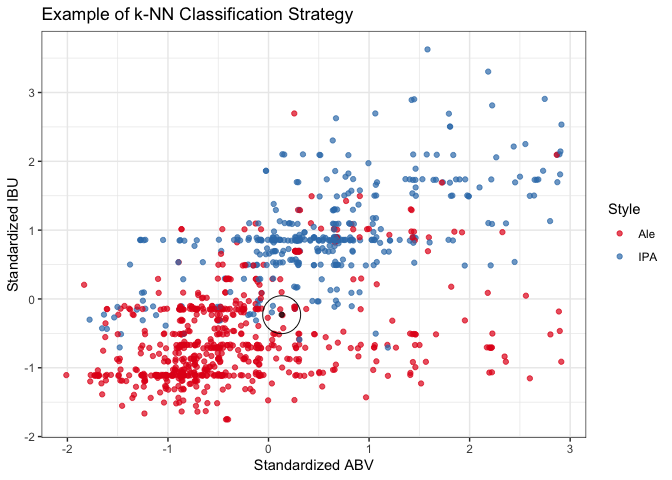

    #ggsave(cls_exPlt, filename = "plots/classifierExamplePlt.png")

A k-NN classifier uses a majority rule approach to predict the
classification of unknown data points based on the classifications of a
defined number of known data points. After tuning the number of
neighbors (k), we tested two cross-validation schemes: external and
internal. Both the external and internal cross-validation models
performed similarly very well. The external model achieves a 88.6%
accuracy, 89.4% sensitivity, and 87.4% specificity when using 16
neighbors. Having a 95% confidence interval of (85.3%, 91.4%), the
accuracy of the model significantly exceeds the accuracy expected by
chance alone (p-value, &lt;2e-16). Based on our model’s sensitivity and
specificity, we correctly classify 89.4% of Ales and 87.4% of IPAs. In
short, the model was very accurate and predicted both true positives and
true negatives with a high probability.

**Question 8b. Next, we generate a Naive Bayes classifier and compare
its performance with that of the k-NN model.**

    #part 2: compare a naive bayes classifier

    #100 different splits
    iters = 100

    #make holders for the stats from each iteration
    masterAccu = matrix(nrow = iters, ncol = 2)
    masterPval = matrix(nrow = iters, ncol = 2)
    masterSens = matrix(nrow = iters, ncol = 2)
    masterSpec = matrix(nrow = iters, ncol = 2)

    #70-30 train/test split
    splitPerc = .7 

    for(i in 1:iters)
    {
    set.seed(i)
      
    #sample 70%
    trainIdx = sample(1:dim(IPAvAle_clean)[1], round(splitPerc*dim(IPAvAle_clean)[1]))
    #choose the rows that match those sampled numbers for training
    IPAvAleTrn = IPAvAle_clean[trainIdx,]
    #and the others for testing
    IPAvAleTst = IPAvAle_clean[-trainIdx,]

    head(IPAvAleTrn)
    head(IPAvAleTst)

    #use the filtered (IPA/Ale) dataset
    #give the model the training ABV and IBU variables, training labels
    modelNB = naiveBayes(IPAvAleTrn[,c("ABV", "IBU")], IPAvAleTrn$IBU_Profile, laplace = 1)

    #use the model and testing ABV and IBU to predict the testing labels
    preds = predict(modelNB, IPAvAleTst[c("ABV", "IBU")])

    #make a confusion matrix comparing the predicted labels to the true labels
    #predicted labels = rows, true labels = cols
    CM = confusionMatrix(table(preds, IPAvAleTst$IBU_Profile))

    masterAccu[i,] = c(i, CM$overall["Accuracy"])
    masterPval[i,] = c(i, CM$overall["AccuracyPValue"])
    masterSens[i,] = c(i, CM$byClass["Sensitivity"])
    masterSpec[i,] = c(i, CM$byClass["Specificity"])
    }

    #organizing the output data
    colnames(masterAccu) = c("Seed", "Accuracy")
    colnames(masterPval) = c("Seed", "AccuracyPValue")
    colnames(masterSens) = c("Seed", "Sensitivity")
    colnames(masterSpec) = c("Seed", "Specificity")
    NB_results = merge(as.data.frame(masterAccu), as.data.frame(masterPval), by = "Seed", all = TRUE)
    NB_results = merge(NB_results, as.data.frame(masterSens), by = "Seed", all = TRUE)
    NB_results = merge(NB_results, as.data.frame(masterSpec), by = "Seed", all = TRUE)

    NB_stats = colMeans(NB_results[,2:5])
    NB_stats = data.frame(
      Metric = c("Accuracy", "AccuracyPValue", "Sensitivity", "Specificity"),
      Value = c(sprintf("%.1f%%", NB_stats[1]*100),
                sprintf("%.2e", NB_stats[2]),
                sprintf("%.1f%%", NB_stats[3]*100),
                sprintf("%.1f%%", NB_stats[4]*100)))

    #output the metrics of the naive bayes model
    cat("Naive Bayes \n")

    Naive Bayes 

    cat("Accuracy:", NB_stats[1,2], "\n")

    Accuracy: 87.4% 

    cat("Accuracy P-Value:", NB_stats[2,2], "\n")

    Accuracy P-Value: 6.70e-23 

    cat("Sensitivity:", NB_stats[3,2], "\n")

    Sensitivity: 89.3% 

    cat("Specificity:", NB_stats[4,2], "\n")

    Specificity: 84.2% 

    KNN_ECV_stats = data.frame(
      Metric = c("Accuracy", "Sensitivity", "Specificity"),
      Value = c(sprintf("%.1f%%", cmE_std$overall[1]*100),
                sprintf("%.1f%%", cmE_std$byClass[1]*100),
                sprintf("%.1f%%", cmE_std$byClass[2]*100)))
    KNN_ICV_stats = data.frame(
      Metric = c("Accuracy", "Sensitivity", "Specificity"),
      Value = c(sprintf("%.1f%%", cmI_std$overall[1]*100),
                sprintf("%.1f%%", cmI_std$byClass[1]*100),
                sprintf("%.1f%%", cmI_std$byClass[2]*100)))

    #merge the results of all the classifiers
    allModels = merge(KNN_ECV_stats, KNN_ICV_stats, by = "Metric", all = TRUE)
    allModels = merge(allModels, NB_stats, by = "Metric", all = FALSE)
    colnames(allModels) = c("Metric", "KNN: External CV", "KNN: Internal CV", "Naive Bayes")

    #print it in a gt table
    allModels %>% gt()

<table class="gt_table" data-quarto-disable-processing="false" data-quarto-bootstrap="false">
  <thead>
    <tr class="gt_col_headings">
      <th class="gt_col_heading gt_columns_bottom_border gt_left" rowspan="1" colspan="1" scope="col" id="Metric">Metric</th>
      <th class="gt_col_heading gt_columns_bottom_border gt_right" rowspan="1" colspan="1" scope="col" id="KNN: External CV">KNN: External CV</th>
      <th class="gt_col_heading gt_columns_bottom_border gt_right" rowspan="1" colspan="1" scope="col" id="KNN: Internal CV">KNN: Internal CV</th>
      <th class="gt_col_heading gt_columns_bottom_border gt_right" rowspan="1" colspan="1" scope="col" id="Naive Bayes">Naive Bayes</th>
    </tr>
  </thead>
  <tbody class="gt_table_body">
    <tr><td headers="Metric" class="gt_row gt_left">Accuracy</td>
<td headers="KNN: External CV" class="gt_row gt_right">88.6%</td>
<td headers="KNN: Internal CV" class="gt_row gt_right">88.9%</td>
<td headers="Naive Bayes" class="gt_row gt_right">87.4%</td></tr>
    <tr><td headers="Metric" class="gt_row gt_left">Sensitivity</td>
<td headers="KNN: External CV" class="gt_row gt_right">89.4%</td>
<td headers="KNN: Internal CV" class="gt_row gt_right">91.5%</td>
<td headers="Naive Bayes" class="gt_row gt_right">89.3%</td></tr>
    <tr><td headers="Metric" class="gt_row gt_left">Specificity</td>
<td headers="KNN: External CV" class="gt_row gt_right">87.4%</td>
<td headers="KNN: Internal CV" class="gt_row gt_right">84.5%</td>
<td headers="Naive Bayes" class="gt_row gt_right">84.2%</td></tr>
  </tbody>
  
  
</table>

The Naive Bayes classifier predicted classifications with an accuracy
significantly above chance level (p-value, 6.70e-23), however it
performed slightly worse than either of the k-NN models. It only
achieved an accuracy of 87.4%, sensitivity of 89.3% and specificity of
84.2%.

**Question 9: Here we look at clusters of states based on their
breweries per capita where the market might have room for expansion.
Then we find the top 10 styles of craft beers in the U.S. overall. We
examined if those states were missing popular beer styles and what most
produced 2 styles each one of those states might want to introduce. We
did utilize generative AI for help with the coding on this one.**

    #Find one other useful inference from the data and back it up with statistical evidence.

    #Import state populations over 18 (2019 US Census)
    #Source: https://www2.census.gov/programs-surveys/popest/datasets/2010-2019/counties/totals/co-est2019-alldata.pdf, library(covidcast)
    str(state_census)

    'data.frame':   57 obs. of  9 variables:
     $ SUMLEV           : num  10 40 40 40 40 40 40 40 40 40 ...
     $ REGION           : chr  "0" "3" "4" "4" ...
     $ DIVISION         : chr  "0" "6" "9" "8" ...
     $ STATE            : num  0 1 2 4 5 6 8 9 10 11 ...
     $ NAME             : chr  "United States" "Alabama" "Alaska" "Arizona" ...
     $ POPESTIMATE2019  : num  3.28e+08 4.90e+06 7.32e+05 7.28e+06 3.02e+06 ...
     $ POPEST18PLUS2019 : int  255200373 3814879 551562 5638481 2317649 30617582 4499217 2837847 770192 577581 ...
     $ PCNT_POPEST18PLUS: num  77.7 77.8 75.4 77.5 76.8 77.5 78.1 79.6 79.1 81.8 ...
     $ ABBR             : chr  "US" "AL" "AK" "AZ" ...

    populations = state_census %>% select(ABBR, POPEST18PLUS2019)
    str(populations)

    'data.frame':   57 obs. of  2 variables:
     $ ABBR            : chr  "US" "AL" "AK" "AZ" ...
     $ POPEST18PLUS2019: int  255200373 3814879 551562 5638481 2317649 30617582 4499217 2837847 770192 577581 ...

    head(populations)

      ABBR POPEST18PLUS2019
    1   US        255200373
    2   AL          3814879
    3   AK           551562
    4   AZ          5638481
    5   AR          2317649
    6   CA         30617582

    colnames(populations) = c("State", "Population") #rename columns

    str(breweries_summary) #from question 1

    tibble [51 × 2] (S3: tbl_df/tbl/data.frame)
     $ Total_Breweries: num [1:51] 7 3 2 11 39 47 8 1 2 15 ...
     $ state_abbv     : chr [1:51] "AK" "AL" "AR" "AZ" ...

    colnames(breweries_summary) = c("Total_Breweries", "State") #rename State

    #merge and do not include territories
    breweries_byCap = merge(populations, breweries_summary, by = "State", all = FALSE)
    #calculate breweries per capita
    breweries_byCap$BreweriesPerCap =  breweries_byCap$Total_Breweries / breweries_byCap$Population * 1000000
    #sort
    breweries_byCap = breweries_byCap[order(-breweries_byCap$BreweriesPerCap), ]

    #five number summary
    summary(breweries_byCap$BreweriesPerCap)

       Min. 1st Qu.  Median    Mean 3rd Qu.    Max. 
     0.4321  1.2852  1.9969  3.3739  3.7994 19.6085 

    breweries_byCap %>%
      ggplot(aes(x = reorder(State, -BreweriesPerCap), y = BreweriesPerCap)) +
      geom_col() +
      ggtitle("Breweries Per Capita") +
      xlab("State") +
      ylab("Breweries per million people") +
      theme_bw() +
      theme(axis.text.x = element_text(angle = 90, hjust = 1))

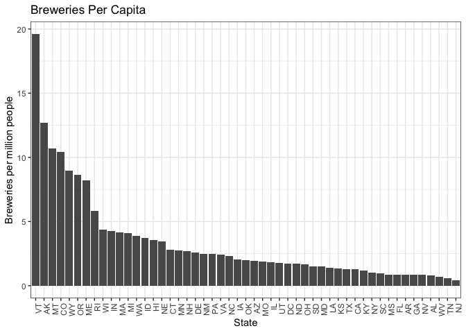

    #create quartile groups
    breweries_byCap$percentile = cut(breweries_byCap$BreweriesPerCap,
                                    breaks = quantile(breweries_byCap$BreweriesPerCap, probs = c(seq(0, 1, 0.2))),
                                    labels = c("0-20 percentile", "20-40  percentile", "40-60  percentile", "60-80  percentile", "80-100  percentile"))

    #plot
    breweries_byCap %>% filter(State != "NJ") %>% 
      ggplot(aes(x = reorder(State, BreweriesPerCap), y = BreweriesPerCap)) +
      geom_col() +
      ggtitle("Breweries Per Capita") +
      xlab("State") +
      ylab("Breweries per million people") +
      theme_bw() +
      theme(axis.text.x = element_text(angle = 90, hjust = 1)) +
      facet_wrap(~ percentile, scales = "free")

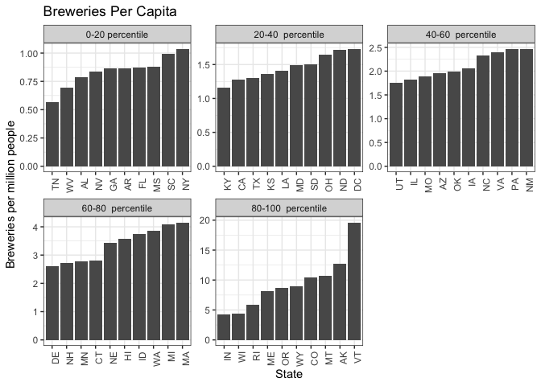

    breweries_byCap %>% filter(BreweriesPerCap >= 1.0 & BreweriesPerCap <= 5.0) %>% 
      ggplot(aes(x = reorder(State, -BreweriesPerCap), y = BreweriesPerCap)) +
      geom_col() +
      ggtitle("Breweries Per Capita") +
      xlab("State") +
      ylab("Breweries per million people") +
      theme_bw() +
      theme(axis.text.x = element_text(angle = 90, hjust = 1))

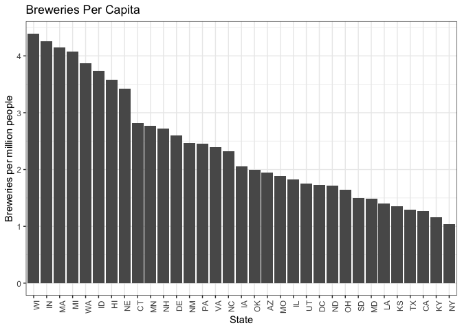

    #There appears to be a group of states above 5 breweries per million, a grouping from ~3-5
    #a group from ~2-3, and then lower groups
    #We examined the 3-5 and 2-3 groups for missing styles.
    #The 3-5 doesn't have much growth opportunity by this metric. The 2-3 does. 
    #The 2-3 can be our emerging market.

    #count beers per style
    beer_styles_summary = bbDF %>%
      group_by(Style) %>%
      summarize(Total_Style = sum(count))

    #arrange styles in descending order of popularity
    sorted_styles = beer_styles_summary %>%
      arrange(desc(Total_Style))

    #get the top 10 styles in the US
    top_styles_US = head(sorted_styles, 10)

    #get 3rd  block of states by breweries per capita, 2-3 breweries/million
    #(states with opportunities for market expansion)
    # growth_states = top_states[11:20, ] #Get 11-20th ranked states
    third_tier = breweries_byCap %>% filter(BreweriesPerCap > 2.0 & BreweriesPerCap <= 3.0)
    second_tier = breweries_byCap %>% filter(BreweriesPerCap > 3.0 & BreweriesPerCap <= 5.0)

    #filter bbDF for just the growth states
    bbDF$State = trimws(bbDF$State)
    bbDF_growth_states = bbDF %>%
      filter(State %in% third_tier$State)

    #group by state and style and rank styles in each of those states
    styles_by_state = bbDF_growth_states %>%
      group_by(State, Style) %>%
      summarize(Total_Style = sum(count))

    #identify missing styles for each state
    get_missing_styles = function(state_df, best_styles) {
      missing_styles = setdiff(best_styles, state_df$Style)
      return(head(missing_styles, 2))
    }

    #iterate through each state's summary dataframe
    missing_styles = lapply(unique(styles_by_state$State), function(state) {
      state_df = filter(styles_by_state, State == state)
      missing = get_missing_styles(state_df, top_styles_US$Style)
      return(data.frame(State = state, Missing_Style_1 = missing[1], Missing_Style_2 = missing[2]))
    })

    #combine results into a single dataframe
    missing_styles_df = do.call(rbind, missing_styles)

    #replace NA values in the missing styles dataframe
    missing_styles_df$Missing_Style_2[is.na(missing_styles_df$Missing_Style_2) & !is.na(missing_styles_df$Missing_Style_1)] = "only 1 popular style missing"
    missing_styles_df$Missing_Style_1[is.na(missing_styles_df$Missing_Style_1)] = "no popular styles missing"
    missing_styles_df$Missing_Style_2[is.na(missing_styles_df$Missing_Style_2)] = "no popular styles missing"

    #organize output tables
    colnames(top_styles_US) = c("Top_Style", "Number_Produced")
    top_styles_US %>%
      gt() %>%
      tab_header(title = "Most Popular US Beer")

<table class="gt_table" data-quarto-disable-processing="false" data-quarto-bootstrap="false">
  <thead>
    <tr class="gt_heading">
      <td colspan="2" class="gt_heading gt_title gt_font_normal gt_bottom_border" style>Most Popular US Beer</td>
    </tr>
    
    <tr class="gt_col_headings">
      <th class="gt_col_heading gt_columns_bottom_border gt_center" rowspan="1" colspan="1" scope="col" id="Top_Style">Top_Style</th>
      <th class="gt_col_heading gt_columns_bottom_border gt_right" rowspan="1" colspan="1" scope="col" id="Number_Produced">Number_Produced</th>
    </tr>
  </thead>
  <tbody class="gt_table_body">
    <tr><td headers="Top_Style" class="gt_row gt_center">American IPA</td>
<td headers="Number_Produced" class="gt_row gt_right">424</td></tr>
    <tr><td headers="Top_Style" class="gt_row gt_center">American Pale Ale (APA)</td>
<td headers="Number_Produced" class="gt_row gt_right">245</td></tr>
    <tr><td headers="Top_Style" class="gt_row gt_center">American Amber / Red Ale</td>
<td headers="Number_Produced" class="gt_row gt_right">133</td></tr>
    <tr><td headers="Top_Style" class="gt_row gt_center">American Blonde Ale</td>
<td headers="Number_Produced" class="gt_row gt_right">108</td></tr>
    <tr><td headers="Top_Style" class="gt_row gt_center">American Double / Imperial IPA</td>
<td headers="Number_Produced" class="gt_row gt_right">105</td></tr>
    <tr><td headers="Top_Style" class="gt_row gt_center">American Pale Wheat Ale</td>
<td headers="Number_Produced" class="gt_row gt_right">97</td></tr>
    <tr><td headers="Top_Style" class="gt_row gt_center">American Brown Ale</td>
<td headers="Number_Produced" class="gt_row gt_right">70</td></tr>
    <tr><td headers="Top_Style" class="gt_row gt_center">American Porter</td>
<td headers="Number_Produced" class="gt_row gt_right">68</td></tr>
    <tr><td headers="Top_Style" class="gt_row gt_center">Saison / Farmhouse Ale</td>
<td headers="Number_Produced" class="gt_row gt_right">52</td></tr>
    <tr><td headers="Top_Style" class="gt_row gt_center">Witbier</td>
<td headers="Number_Produced" class="gt_row gt_right">51</td></tr>
  </tbody>
  
  
</table>

    colnames(third_tier) = c("State", "Population", "Total Breweries", "Breweries_Per_Million", "Percentile")
    merge(missing_styles_df, third_tier[,c("State", "Breweries_Per_Million")], by = "State") %>%
      arrange(desc(Breweries_Per_Million)) %>%
      gt() %>%
      tab_header(title = "Missing Styles in Emerging Markets")

<table class="gt_table" data-quarto-disable-processing="false" data-quarto-bootstrap="false">
  <thead>
    <tr class="gt_heading">
      <td colspan="4" class="gt_heading gt_title gt_font_normal gt_bottom_border" style>Missing Styles in Emerging Markets</td>
    </tr>
    
    <tr class="gt_col_headings">
      <th class="gt_col_heading gt_columns_bottom_border gt_left" rowspan="1" colspan="1" scope="col" id="State">State</th>
      <th class="gt_col_heading gt_columns_bottom_border gt_left" rowspan="1" colspan="1" scope="col" id="Missing_Style_1">Missing_Style_1</th>
      <th class="gt_col_heading gt_columns_bottom_border gt_left" rowspan="1" colspan="1" scope="col" id="Missing_Style_2">Missing_Style_2</th>
      <th class="gt_col_heading gt_columns_bottom_border gt_right" rowspan="1" colspan="1" scope="col" id="Breweries_Per_Million">Breweries_Per_Million</th>
    </tr>
  </thead>
  <tbody class="gt_table_body">
    <tr><td headers="State" class="gt_row gt_left">CT</td>
<td headers="Missing_Style_1" class="gt_row gt_left">American Pale Ale (APA)</td>
<td headers="Missing_Style_2" class="gt_row gt_left">American Pale Wheat Ale</td>
<td headers="Breweries_Per_Million" class="gt_row gt_right">2.819039</td></tr>
    <tr><td headers="State" class="gt_row gt_left">MN</td>
<td headers="Missing_Style_1" class="gt_row gt_left">American Amber / Red Ale</td>
<td headers="Missing_Style_2" class="gt_row gt_left">Witbier</td>
<td headers="Breweries_Per_Million" class="gt_row gt_right">2.767225</td></tr>
    <tr><td headers="State" class="gt_row gt_left">NH</td>
<td headers="Missing_Style_1" class="gt_row gt_left">American Amber / Red Ale</td>
<td headers="Missing_Style_2" class="gt_row gt_left">American Blonde Ale</td>
<td headers="Breweries_Per_Million" class="gt_row gt_right">2.716264</td></tr>
    <tr><td headers="State" class="gt_row gt_left">DE</td>
<td headers="Missing_Style_1" class="gt_row gt_left">American Amber / Red Ale</td>
<td headers="Missing_Style_2" class="gt_row gt_left">American Blonde Ale</td>
<td headers="Breweries_Per_Million" class="gt_row gt_right">2.596755</td></tr>
    <tr><td headers="State" class="gt_row gt_left">NM</td>
<td headers="Missing_Style_1" class="gt_row gt_left">American Pale Ale (APA)</td>
<td headers="Missing_Style_2" class="gt_row gt_left">American Blonde Ale</td>
<td headers="Breweries_Per_Million" class="gt_row gt_right">2.467626</td></tr>
    <tr><td headers="State" class="gt_row gt_left">PA</td>
<td headers="Missing_Style_1" class="gt_row gt_left">no popular styles missing</td>
<td headers="Missing_Style_2" class="gt_row gt_left">no popular styles missing</td>
<td headers="Breweries_Per_Million" class="gt_row gt_right">2.458845</td></tr>
    <tr><td headers="State" class="gt_row gt_left">VA</td>
<td headers="Missing_Style_1" class="gt_row gt_left">American Blonde Ale</td>
<td headers="Missing_Style_2" class="gt_row gt_left">American Pale Wheat Ale</td>
<td headers="Breweries_Per_Million" class="gt_row gt_right">2.397122</td></tr>
    <tr><td headers="State" class="gt_row gt_left">NC</td>
<td headers="Missing_Style_1" class="gt_row gt_left">Saison / Farmhouse Ale</td>
<td headers="Missing_Style_2" class="gt_row gt_left">only 1 popular style missing</td>
<td headers="Breweries_Per_Million" class="gt_row gt_right">2.320648</td></tr>
    <tr><td headers="State" class="gt_row gt_left">IA</td>
<td headers="Missing_Style_1" class="gt_row gt_left">American Double / Imperial IPA</td>
<td headers="Missing_Style_2" class="gt_row gt_left">American Pale Wheat Ale</td>
<td headers="Breweries_Per_Million" class="gt_row gt_right">2.059114</td></tr>
  </tbody>
  
  
</table>

    #plot states for demo
    breweries_byCap$cluster = ifelse(breweries_byCap$State %in% third_tier$State, "3rd", 0)
    breweries_byCap$cluster = ifelse(breweries_byCap$State %in% second_tier$State, "2nd", breweries_byCap$cluster)
    breweriesPerCap_plt = breweries_byCap %>% 
      ggplot(aes(x = reorder(State, -BreweriesPerCap), y = BreweriesPerCap, fill = as.factor(cluster))) +
      geom_col() +
      ggtitle("Breweries Per Capita") +
      xlab("State") +
      ylab("Breweries per million people") +
      labs(fill = "Target\nFor Growth") +
      scale_fill_manual(values = c("3rd" = "red3", "2nd" = "royalblue3", "0" = "gray"),
                        labels = c("3rd" = "3rd tier -> Yes", "2nd" = "2nd tier -> No", "0" = "No"),
                        breaks = c("3rd", "2nd", "0")) +
      theme_bw() +
      theme(axis.text.x = element_text(angle = 90, hjust = 1),
            legend.position = "none") +  
      theme(legend.justification = c(1, 1),
            legend.position = c(0.85, 0.85)) #+
      #coord_cartesian(ylim = c(0, 7))
    breweriesPerCap_plt

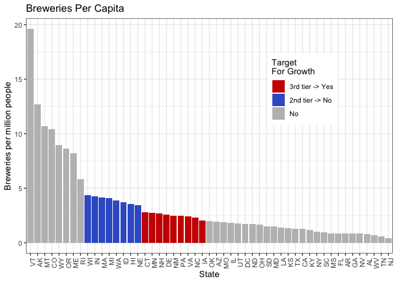

    #ggsave(breweriesPerCap_plt, filename = "plots/breweriesPerCap_plt.png", width = 11, height = 6.75, units = "in")

We analyzed the number of breweries per capita for each state. They
clustered into a top tier, a second tier around the 75th percentile, a
third group above the median, and lower tier groupings. Then, we ranked
the ten most popular beers in the country and compared that list to
beers produced in the second and third tier groups for breweries per
capita.

Many of the most popular beers in the country are currently being
produced in the states at the 75th percentile, but not in the group of
nine states above the median. All nine states in the above-median group
produce the most popular beer in the country, American IPA. However,
seven out of these nine states currently do not produce at least one of
the top five most produced beer styles.

We compiled a table of all nine states and the two most high-ranking
beers not currently being produced in each state. These states may
represent emerging craft beer markets. Given the absence of well-liked
beer styles in these markets, expanding production to include those
styles and targeting these emerging markets may be a worthwhile
strategy.

## Conclusion

The goal of this analysis was to identify salient characteristics of the
craft beer market for the CEO and CFO of Budweiser. Our analysis
included over 500 breweries and over 2400 beers. We uncovered several
interesting findings. First, we found that most breweries are
concentrated in the West Coast and Great Lakes areas. Texas and Colorado
also have a high number of breweries. We also found a strong, positive
correlation between beers’ alcohol levels and bitterness. We found that
using k-NN classification, ABV and IBU are good predictors of beer
style. Finally, we found that within several states with emerging craft
beer markets, there is an opportunity to introduce popular beer styles
that we believe could increase Budweiser’s profits. We hope Budweiser
can use this information to grow its market share and combat the
increased competition from the craft beer market.

### Appendix

**R and package versions used**

    devtools::session_info()

    ─ Session info ─────────────────────────────────────────────────────────────────────────────────────────────────
     setting  value
     version  R version 4.3.2 (2023-10-31)
     os       macOS Monterey 12.7.5
     system   x86_64, darwin20
     ui       RStudio
     language (EN)
     collate  en_US.UTF-8
     ctype    en_US.UTF-8
     tz       America/New_York
     date     2024-08-29
     rstudio  2023.12.1+402 Ocean Storm (desktop)
     pandoc   3.1.1 @ /Applications/RStudio.app/Contents/Resources/app/quarto/bin/tools/ (via rmarkdown)

    ─ Packages ─────────────────────────────────────────────────────────────────────────────────────────────────────
     package      * version    date (UTC) lib source
     cachem         1.1.0      2024-05-16 [1] CRAN (R 4.3.3)
     caret        * 6.0-94     2023-03-21 [1] CRAN (R 4.3.0)
     chromote       0.2.0      2024-02-12 [1] CRAN (R 4.3.2)
     class        * 7.3-22     2023-05-03 [1] CRAN (R 4.3.2)
     classInt       0.4-10     2023-09-05 [1] CRAN (R 4.3.0)
     cli            3.6.2      2023-12-11 [1] CRAN (R 4.3.0)
     codetools      0.2-19     2023-02-01 [1] CRAN (R 4.3.2)
     colorspace     2.1-0      2023-01-23 [1] CRAN (R 4.3.0)
     covidcast    * 0.5.2      2023-07-12 [1] CRAN (R 4.3.0)
     crayon         1.5.2      2022-09-29 [1] CRAN (R 4.3.0)
     data.table     1.14.10    2023-12-08 [1] CRAN (R 4.3.0)
     DataExplorer * 0.8.3      2024-01-24 [1] CRAN (R 4.3.2)
     DBI            1.2.2      2024-02-16 [1] CRAN (R 4.3.2)
     devtools       2.4.5      2022-10-11 [1] CRAN (R 4.3.0)
     digest         0.6.33     2023-07-07 [1] CRAN (R 4.3.0)
     dplyr        * 1.1.4      2023-11-17 [1] CRAN (R 4.3.0)
     e1071        * 1.7-14     2023-12-06 [1] CRAN (R 4.3.0)
     ellipsis       0.3.2      2021-04-29 [1] CRAN (R 4.3.0)
     evaluate       0.23       2023-11-01 [1] CRAN (R 4.3.0)
     fansi          1.0.6      2023-12-08 [1] CRAN (R 4.3.0)
     farver         2.1.1      2022-07-06 [1] CRAN (R 4.3.0)
     fastmap        1.2.0      2024-05-15 [1] CRAN (R 4.3.3)
     forcats      * 1.0.0      2023-01-29 [1] CRAN (R 4.3.0)
     foreach        1.5.2      2022-02-02 [1] CRAN (R 4.3.0)
     fs             1.6.3      2023-07-20 [1] CRAN (R 4.3.0)
     future         1.33.1     2023-12-22 [1] CRAN (R 4.3.0)
     future.apply   1.11.1     2023-12-21 [1] CRAN (R 4.3.0)
     generics       0.1.3      2022-07-05 [1] CRAN (R 4.3.0)
     ggplot2      * 3.5.1      2024-04-23 [1] CRAN (R 4.3.2)
     globals        0.16.2     2022-11-21 [1] CRAN (R 4.3.0)
     glue           1.7.0      2024-01-09 [1] CRAN (R 4.3.0)
     gower          1.0.1      2022-12-22 [1] CRAN (R 4.3.0)
     gridExtra      2.3        2017-09-09 [1] CRAN (R 4.3.0)
     gt           * 0.10.1     2024-01-17 [1] CRAN (R 4.3.0)
     gtable         0.3.4      2023-08-21 [1] CRAN (R 4.3.0)
     hardhat        1.3.1      2024-02-02 [1] CRAN (R 4.3.2)
     highr          0.10       2022-12-22 [1] CRAN (R 4.3.0)
     hms            1.1.3      2023-03-21 [1] CRAN (R 4.3.0)
     htmltools      0.5.7      2023-11-03 [1] CRAN (R 4.3.0)
     htmlwidgets    1.6.4      2023-12-06 [1] CRAN (R 4.3.0)
     httpuv         1.6.13     2023-12-06 [1] CRAN (R 4.3.0)
     igraph         1.6.0      2023-12-11 [1] CRAN (R 4.3.0)
     ipred          0.9-14     2023-03-09 [1] CRAN (R 4.3.0)
     iterators      1.0.14     2022-02-05 [1] CRAN (R 4.3.0)
     jsonlite       1.8.8      2023-12-04 [1] CRAN (R 4.3.0)
     KernSmooth     2.23-22    2023-07-10 [1] CRAN (R 4.3.2)
     knitr          1.45       2023-10-30 [1] CRAN (R 4.3.0)
     labeling       0.4.3      2023-08-29 [1] CRAN (R 4.3.0)
     later          1.3.2      2023-12-06 [1] CRAN (R 4.3.0)
     lattice      * 0.21-9     2023-10-01 [1] CRAN (R 4.3.2)
     lava           1.7.3      2023-11-04 [1] CRAN (R 4.3.0)
     lifecycle      1.0.4      2023-11-07 [1] CRAN (R 4.3.0)
     listenv        0.9.0      2022-12-16 [1] CRAN (R 4.3.0)
     lubridate    * 1.9.3      2023-09-27 [1] CRAN (R 4.3.0)
     magrittr       2.0.3      2022-03-30 [1] CRAN (R 4.3.0)
     MASS           7.3-60     2023-05-04 [1] CRAN (R 4.3.2)
     Matrix         1.6-1.1    2023-09-18 [1] CRAN (R 4.3.2)
     memoise        2.0.1      2021-11-26 [1] CRAN (R 4.3.0)
     mgcv           1.9-0      2023-07-11 [1] CRAN (R 4.3.2)
     mime           0.12       2021-09-28 [1] CRAN (R 4.3.0)
     miniUI         0.1.1.1    2018-05-18 [1] CRAN (R 4.3.0)
     MMWRweek       0.1.3      2020-04-22 [1] CRAN (R 4.3.0)
     ModelMetrics   1.2.2.2    2020-03-17 [1] CRAN (R 4.3.0)
     munsell        0.5.0      2018-06-12 [1] CRAN (R 4.3.0)
     naniar       * 1.0.0      2023-02-02 [1] CRAN (R 4.3.0)
     networkD3      0.4        2017-03-18 [1] CRAN (R 4.3.0)
     nlme           3.1-163    2023-08-09 [1] CRAN (R 4.3.2)
     nnet           7.3-19     2023-05-03 [1] CRAN (R 4.3.2)
     norm           1.0-11.1   2023-06-18 [1] CRAN (R 4.3.0)
     parallelly     1.36.0     2023-05-26 [1] CRAN (R 4.3.0)
     patchwork    * 1.2.0      2024-01-08 [1] CRAN (R 4.3.0)
     pillar         1.9.0      2023-03-22 [1] CRAN (R 4.3.0)
     pkgbuild       1.4.3      2023-12-10 [1] CRAN (R 4.3.0)
     pkgconfig      2.0.3      2019-09-22 [1] CRAN (R 4.3.0)
     pkgload        1.3.3      2023-09-22 [1] CRAN (R 4.3.0)
     plyr           1.8.9      2023-10-02 [1] CRAN (R 4.3.0)
     pROC           1.18.5     2023-11-01 [1] CRAN (R 4.3.0)
     processx       3.8.3      2023-12-10 [1] CRAN (R 4.3.0)
     prodlim        2023.08.28 2023-08-28 [1] CRAN (R 4.3.0)
     profvis        0.3.8      2023-05-02 [1] CRAN (R 4.3.0)
     promises       1.2.1      2023-08-10 [1] CRAN (R 4.3.0)
     proxy          0.4-27     2022-06-09 [1] CRAN (R 4.3.0)
     ps             1.7.5      2023-04-18 [1] CRAN (R 4.3.0)
     purrr        * 1.0.2      2023-08-10 [1] CRAN (R 4.3.0)
     R6             2.5.1      2021-08-19 [1] CRAN (R 4.3.0)
     RColorBrewer * 1.1-3      2022-04-03 [1] CRAN (R 4.3.0)
     Rcpp           1.0.12     2024-01-09 [1] CRAN (R 4.3.0)
     readr        * 2.1.4      2023-02-10 [1] CRAN (R 4.3.0)
     recipes        1.0.9      2023-12-13 [1] CRAN (R 4.3.0)
     remotes        2.4.2.1    2023-07-18 [1] CRAN (R 4.3.0)
     reshape2       1.4.4      2020-04-09 [1] CRAN (R 4.3.0)
     rlang          1.1.3      2024-01-10 [1] CRAN (R 4.3.0)
     rmarkdown      2.25       2023-09-18 [1] CRAN (R 4.3.0)
     rpart          4.1.21     2023-10-09 [1] CRAN (R 4.3.2)
     rsconnect      1.2.1      2024-01-31 [1] CRAN (R 4.3.2)
     rstudioapi     0.15.0     2023-07-07 [1] CRAN (R 4.3.0)
     sass           0.4.8      2023-12-06 [1] CRAN (R 4.3.0)
     scales       * 1.3.0      2023-11-28 [1] CRAN (R 4.3.0)
     sessioninfo    1.2.2      2021-12-06 [1] CRAN (R 4.3.0)
     sf           * 1.0-15     2023-12-18 [1] CRAN (R 4.3.0)
     shiny          1.9.1      2024-08-01 [1] CRAN (R 4.3.3)
     stringi        1.8.3      2023-12-11 [1] CRAN (R 4.3.0)
     stringr      * 1.5.1      2023-11-14 [1] CRAN (R 4.3.0)
     survival       3.5-7      2023-08-14 [1] CRAN (R 4.3.2)
     tibble       * 3.2.1      2023-03-20 [1] CRAN (R 4.3.0)
     tidyr        * 1.3.0      2023-01-24 [1] CRAN (R 4.3.0)
     tidyselect     1.2.0      2022-10-10 [1] CRAN (R 4.3.0)
     tidyverse    * 2.0.0      2023-02-22 [1] CRAN (R 4.3.0)
     timechange     0.2.0      2023-01-11 [1] CRAN (R 4.3.0)
     timeDate       4032.109   2023-12-14 [1] CRAN (R 4.3.0)
     tzdb           0.4.0      2023-05-12 [1] CRAN (R 4.3.0)
     units          0.8-5      2023-11-28 [1] CRAN (R 4.3.0)
     UpSetR         1.4.0      2019-05-22 [1] CRAN (R 4.3.0)
     urbnmapr     * 0.0.0.9002 2024-02-27 [1] Github (UrbanInstitute/urbnmapr@ef9f448)
     urlchecker     1.0.1      2021-11-30 [1] CRAN (R 4.3.0)
     usethis        2.2.2      2023-07-06 [1] CRAN (R 4.3.0)
     utf8           1.2.4      2023-10-22 [1] CRAN (R 4.3.0)
     vctrs          0.6.5      2023-12-01 [1] CRAN (R 4.3.0)
     visdat         0.6.0      2023-02-02 [1] CRAN (R 4.3.0)
     webshot2     * 0.1.1      2023-08-11 [1] CRAN (R 4.3.0)
     websocket      1.4.1      2021-08-18 [1] CRAN (R 4.3.0)
     withr          2.5.2      2023-10-30 [1] CRAN (R 4.3.0)
     xfun           0.41       2023-11-01 [1] CRAN (R 4.3.0)
     xml2           1.3.6      2023-12-04 [1] CRAN (R 4.3.0)
     xtable         1.8-4      2019-04-21 [1] CRAN (R 4.3.0)
     yaml           2.3.8      2023-12-11 [1] CRAN (R 4.3.0)

     [1] /Library/Frameworks/R.framework/Versions/4.3-x86_64/Resources/library

    ────────────────────────────────────────────────────────────────────────────────────────────────────────────────

    # rmarkdown::render("_projects/Analysis_BeersAndBreweries.Rmd", "md_document")
